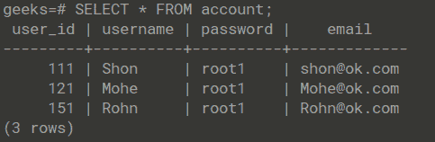
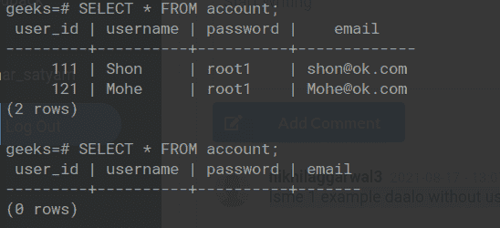
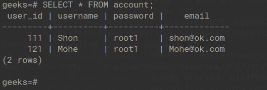

# Python PostgreSQL–删除数据

> 原文:[https://www . geesforgeks . org/python-PostgreSQL-delete-data/](https://www.geeksforgeeks.org/python-postgresql-delete-data/)

在本文中，我们将看到如何使用 Python 中的 pyscopg2 模块从 PostgreSQL 中删除表中的数据。在 PostgreSQL 中，DELETE TABLE 用于从数据库中删除现有表中的数据。它会删除该表的表定义以及所有关联的数据、索引、规则、触发器和约束。如果特定的表不存在，那么它会显示一个错误。

### 使用的表格:

这里，我们使用帐户表进行演示。



现在让我们删除这个表，因为我们将使用 will **psycopg2** 模块来连接 PostgreSQL 并在 cursor.execute(query)对象中执行 SQL 查询。

> **语法:**cursor . execute(SQL _ query)；

### **例 1:从表中删除所有数据**

这里我们使用 DELETE 子句删除所有的表数据。

> **语法:**从表名中删除

**代码:**

## 蟒蛇 3

```
# importing psycopg2
import psycopg2

conn=psycopg2.connect(
    database="geeks",
    user="postgres",
    password="root",
    host="localhost",
    port="5432"
)

# Creating a cursor object using the cursor() 
# method
cursor = conn.cursor()

# delete all details from account table
sql = ''' DELETE FROM account '''

# Executing the query
cursor.execute(sql)

# Commit your changes in the database
conn.commit()

# Closing the connection
conn.close()
```

**输出:**



### **例 2:使用 where** 子句

Where 子句在 SQL 中用作条件语句，是用来过滤记录的。

> **语法:**从表中删除 _ 名称从哪里条件

**代号:**

## 蟒蛇 3

```
# importing psycopg2
import psycopg2

conn=psycopg2.connect(
    database="geeks",
    user="postgres",
    password="password",
    host="localhost",
    port="5432"
)

# Creating a cursor object using the cursor() 
# method
cursor = conn.cursor()

# delete details of row where id =1 from account 
# table
sql = ''' DELETE FROM account WHERE id='151' '''

# Executing the query
cursor.execute(sql)

# Commit your changes in the database
conn.commit()

# Closing the connection
conn.close()
```

**输出:**

