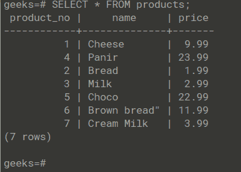
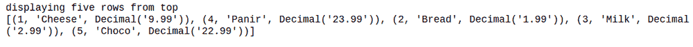
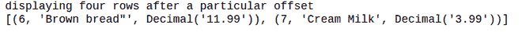

# Python PostgreSQL–限制条款

> 原文:[https://www . geesforgeks . org/python-PostgreSQL-limit-子句/](https://www.geeksforgeeks.org/python-postgresql-limit-clause/)

在本文中，我们将看到如何使用 Python 中的 pyscopg2 模块在 PostgreSQL 中使用 limit 子句。在 PostgreSQL 中 **LIMIT** 约束查询返回的行数。默认情况下，它用于从顶部显示特定数量的行。如果我们想在返回行之前跳过一些行，那么我们在 **LIMIT** 子句之后使用 **OFFSET** 子句。

> **不使用 OFFSET 的语法:**SELECT _ list FROM _ table _ name LIMIT _ no _ of _ rows；
> 
> **使用 OFFSET 的语法:**SELECT _ list FROM _ table _ name LIMIT no _ of _ rows OFFSET rows _ to _ skip；

## 使用的表格:

这里，我们使用产品表进行演示。



现在让我们使用这个表中的限制，因为我们将使用 will **psycopg2** 模块来连接 PostgreSQL 并在 cursor.execute(query)对象中执行 SQL 查询。

> **语法:**cursor . execute(SQL _ query)；

### 示例 1:使用 Python 在 Postgres 中使用一个限制子句

## 蟒蛇 3

```
# importing psycopg2
import psycopg2

conn=psycopg2.connect(
    database="geeks",
    user="postgres",
    password="root",
    host="localhost",
    port="5432"
)

# Creating a cursor object using the cursor() method
cursor = conn.cursor()

print("\ndisplaying five rows from top");
sql = '''SELECT * from products LIMIT 5 '''

# Executing the query
cursor.execute(sql)

# Fetching the data
result = cursor.fetchall();
print(result)

# Commit changes in the database
conn.commit()

# Closing the connection
conn.close()
```

**输出:**



Postgres 限制条款

### 示例 2: 使用 Python 在 Postgres 中使用 limit 和 offset 子句

## 蟒蛇 3

```
# importing psycopg2
import psycopg2

conn=psycopg2.connect(
    database="geeks",
    user="postgres",
    password="root",
    host="localhost",
    port="5432"
)

# Creating a cursor object using the cursor() method
cursor = conn.cursor()
print("displaying four rows after a particular offset");
sql1 = '''SELECT * from products LIMIT 4 OFFSET 5 '''

# Executing the query
cursor.execute(sql1)

# Fetching the data
result1 = cursor.fetchall();
print(result1)

# Commit changes in the database
conn.commit()

# Closing the connection
conn.close()
```

**输出:**



带偏移量的 Postgres 限制子句