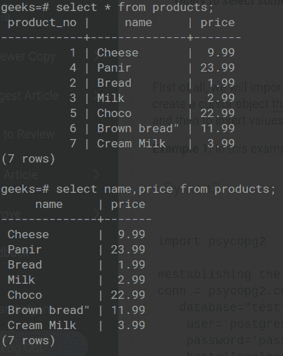

# Python PostgreSQL–选择数据

> 原文:[https://www . geesforgeks . org/python-PostgreSQL-select-data/](https://www.geeksforgeeks.org/python-postgresql-select-data/)

在本文中，我们将看到如何在 PostgreSQL 和 psycopg2 中使用 Python 使用 select 数据。

## **安装**

打开命令提示符，写下下面给出的命令。

```py
pip install psycopg2
```

**SELECT** 语句用于检索 PostgreSQL 中现有表所需的详细信息。返回的数据存储在称为结果集的结果表中。使用 select 命令的数据检索仅限于指定的列数。如果我们想要检索所有的列，那么我们使用(*)。

> **语法:**
> 
> **查询选择表的所有详细信息:**选择* FROM 表名
> 
> **查询选择表的一些具体明细:** SELECT column_name1，column_name2，…。从表名

#### SELECT 命令的表格演示:



**例 1:** 显示表中所有数据。

## 蟒蛇 3

```py
import psycopg2

# establishing the connection
conn = psycopg2.connect(
   database="test",
    user='postgres',
    password='password',
    host='localhost',
    port= '5432'
)

# Creating a cursor object using the cursor()
# method
cursor = conn.cursor()

sql = '''CREATE TABLE WORKER(
   ID BIGSERIAL NOT NULL PRIMARY KEY,
   NAME VARCHAR(100) NOT NULL,
   COUNTRY VARCHAR(50) NOT NULL,
   AGE INT,
   SALARY FLOAT    
)'''
cursor.execute(sql)

# Inserting values into the table
insert_stmt = "INSERT INTO WORKER (NAME, COUNTRY,\
AGE, SALARY) VALUES (%s, %s, %s, %s)"
data = [('Krishna', 'India', 19,2000),
   ('Harry', 'USA', 20,7000),
   ('Malang', 'Nepal', 25, 5000),
   ('Apple', 'London', 26, 2000),
   ('Vishnu', 'India', 29,2000),
   ('Frank', 'UAE', 21,7000),
   ('Master', 'USA', 25, 5000),
   ('Montu', 'India', 26, 2000),
        ]
cursor.executemany(insert_stmt, data)

# Display whole table
cursor.execute("SELECT * FROM WORKER")
print(cursor.fetchall())

# Commit your changes in the database
conn.commit()

#Closing the connection
conn.close()
```

**输出:**

> [(“克里希纳”，“印度”，19，2000)、(“哈里”，“美国”，20，7000)、(“马朗”，“尼泊尔”，25，5000)、(“苹果”，“伦敦”，26，2000)、(“毗湿奴”，“印度”，29，2000)、(“弗兰克”，“阿联酋”，21，7000)、(“大师”，“美国”，25，5000)、(“门图神”，“印度”，26，2000)]

**例 2:** 返回表格的一些具体细节。

## 蟒蛇 3

```py
import psycopg2

# establishing the connection
conn = psycopg2.connect(
   database="test",
    user='postgres',
    password='password',
    host='localhost',
    port= '5432'
)

# Creating a cursor object using the cursor()
# method
cursor = conn.cursor()

sql = '''CREATE TABLE WORKER(
   ID BIGSERIAL NOT NULL PRIMARY KEY,
   NAME VARCHAR(100) NOT NULL,
   COUNTRY VARCHAR(50) NOT NULL,
   AGE INT,
   SALARY FLOAT    
)'''
cursor.execute(sql)

# Inserting values into the table
insert_stmt = "INSERT INTO WORKER (NAME, COUNTRY,\
AGE, SALARY) VALUES (%s, %s, %s, %s)"
data = [('Krishna', 'India', 19,2000),
   ('Harry', 'USA', 20,7000),
   ('Malang', 'Nepal', 25, 5000),
   ('Apple', 'London', 26, 2000),
   ('Vishnu', 'India', 29,2000),
   ('Frank', 'UAE', 21,7000),
   ('Master', 'USA', 25, 5000),
   ('Montu', 'India', 26, 2000),
        ]
cursor.executemany(insert_stmt, data)

# Retrieving only NAME and SALARY FROM WORKER
cursor.execute("SELECT NAME, COUNTRY from WORKER")
print(cursor.fetchall())

# Commit your changes in the database
conn.commit()

# Closing the connection
conn.close()
```

**输出:**

> [('克里希纳'，'印度')，('哈里'，'美国')，('马兰'，'尼泊尔'，('苹果'，'伦敦')，('毗湿奴'，'印度')，('法兰克'，'阿联酋'，('大师'，'美国')，('门图神'，'印度')]