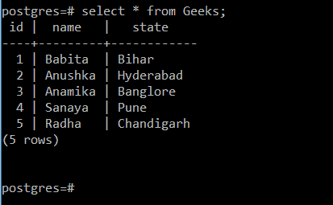
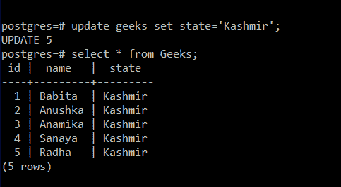
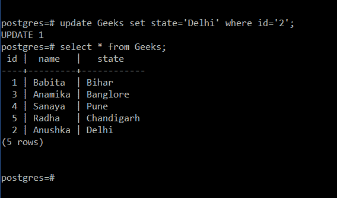

# Python PostgreSQL–更新表

> 原文:[https://www . geesforgeks . org/python-PostgreSQL-update-table/](https://www.geeksforgeeks.org/python-postgresql-update-table/)

在本文中，我们将看到如何使用 python 和 Psycopg2 在 PostgreSQL 中更新数据。update 命令用于修改表中的现有记录。默认情况下，特定属性的所有记录都会被修改，但是要修改某个特定的行，我们需要使用 where 子句和 update 子句。

> **更新子句的语法**
> 
> UPDATE table_name SET 列 1 =值 1，列 2 =值 2，…

#### **演示表:**



### **示例 1:** 使用 Python–pscopg2 更新表的列

这里我们将看到如何更新表的列。修改后的表格如下表所示。正如我们可以看到的，对于每个元组，状态值都被更改为克什米尔。



## 蟒蛇 3

```
# importing psycopg2 module
import psycopg2

# establishing the connection
conn = psycopg2.connect(
   database="postgres",
    user='postgres',
    password='password',
    host='localhost',
    port= '5432'
)

# creating a cursor object
cursor = conn.cursor()

# query to update table with where clause
sql='''update Geeks set state='Kashmir'; '''

# execute the query
cursor.execute(sql)
print('table updated..')

print('table after updation...')
sql2='''select * from Geeks;'''
cursor.execute(sql2);

# print table after modification
print(cursor.fetchall())

# Commit your changes in the database
conn.commit()

# Closing the connection
conn.close()# code
```

**输出**

```
table updated..
table after updation...
[(1,'Babita','kashmir'),(2,'Anushka','Kashmir'),(3,'Anamika','Kashmir'),
(4,'Sanaya','Kashmir'),(5,'Radha','Kashmir')]
```

### **示例 2:** 使用 where 子句更新列

这里我们将使用 where 子句和更新表。

> **语法:** UPDATE Geeks 设置状态= '德里'，其中 id = 2；

我们可以看到具有 **id** 2 的行的**状态**从**海得拉巴**变为**德里**。



## 蟒蛇 3

```
# importing psycopg2 module
import psycopg2

# establishing the connection
conn = psycopg2.connect(
   database="postgres",
    user='postgres',
    password='password',
    host='localhost',
    port= '5432'
)

# create a cursor object
cursor = conn.cursor()

# query to update table
sql='''update Geeks set state='Delhi' where id='2'; '''

# execute the query
cursor.execute(sql)
print("Table updated..")

print('Table after updation...')

# query to display Geeks table
sql2='select * from Geeks;'

# execute query
cursor.execute(sql2);

# fetching all details
print(cursor.fetchall());

# Commit your changes in the database
conn.commit()

# Closing the connection
conn.close()
```

**输出:**

```
Table updated..
Table after updation...
[(1, 'Babita', 'Bihar'), (3, 'Anamika', 'Banglore'), 
(4, 'Sanaya', 'Pune'), (5, 'Radha', 'Chandigarh'),
 (2, 'Anushka', 'Delhi')]
```