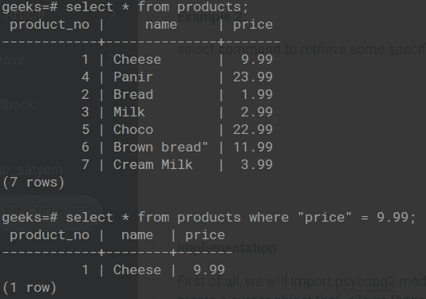
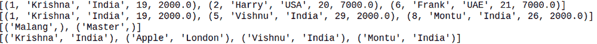

# Python 后缀 SQL–Where 子句

> 原文:[https://www . geesforgeks . org/python-PostgreSQL-where-子句/](https://www.geeksforgeeks.org/python-postgresql-where-clause/)

在本文中，我们将看到如何使用 Python 中的 Psycopg2 在 PostgreSQL 中使用 Where 子句。

Where 子句帮助我们轻松处理数据库。正如我们所知，我们的数据库中存储了大量数据，因此只提取有用和必需的信息子句是有帮助的。 **WHERE** 子句仅用于提取那些满足要求条件的记录。

> **语法:**选择列 1，列 2，…..FROM 表名 WHERE 条件

#### 带有 where 子句的表格演示:



**示例:**首先，这里我们已经展示了如何创建一个表，然后在其中插入值。

## 蟒蛇 3

```
import psycopg2

# establishing the connection
conn = psycopg2.connect(
    database="test",
    user='postgres',
    password='password',
    host='localhost',
    port='5432'
)

# Creating a cursor object using the cursor() method
cursor = conn.cursor()

sql = '''CREATE TABLE WORKER(
   ID BIGSERIAL NOT NULL PRIMARY KEY,
   NAME VARCHAR(100) NOT NULL,
   COUNTRY VARCHAR(50) NOT NULL,
   AGE INT,
   SALARY FLOAT   
)'''
cursor.execute(sql)

# Inserting values into the table
insert_stmt = "INSERT INTO WORKER (NAME, COUNTRY, AGE, SALARY) \
VALUES (%s, %s, %s, %s)"
data = [('Krishna', 'India', 19, 2000),
        ('Harry', 'USA', 20, 7000),
        ('Malang', 'Nepal', 25, 5000),
        ('Apple', 'London', 26, 2000),
        ('Vishnu', 'India', 29, 2000),
        ('Frank', 'UAE', 21, 7000),
        ('Master', 'USA', 25, 5000),
        ('Montu', 'India', 26, 2000),
        ]
cursor.executemany(insert_stmt, data)

# Retrieving specific records using the where clause
cursor.execute("SELECT * from WORKER WHERE AGE <23")
print(cursor.fetchall())

# Retrieving specific records using the where clause
cursor.execute("SELECT * from WORKER WHERE COUNTRY='India' ")
print(cursor.fetchall())

# Retrieving name of employees whose salary is 5000
cursor.execute("SELECT name from WORKER WHERE salary=5000 ")
print(cursor.fetchall())

# Retrieving name and country of employees whose salary is 2000
cursor.execute("SELECT name, country from WORKER WHERE salary=2000 ")
print(cursor.fetchall())

# Commit your changes in the database
conn.commit()

# Closing the connection
conn.close()
```

**输出:**



Python 中使用 pyscopg2 的 where 子句