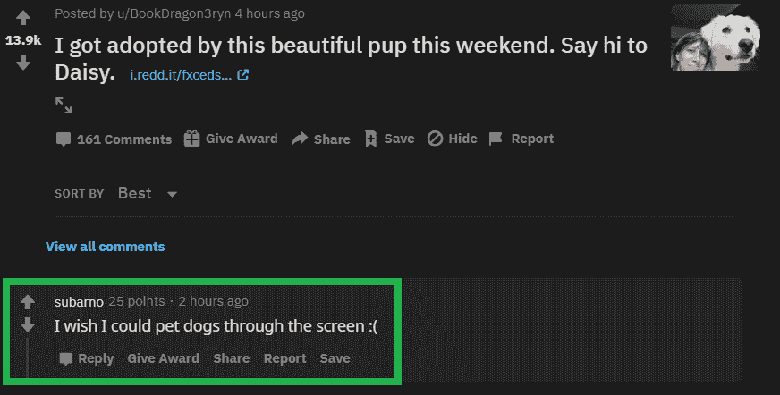

# Python PRAW–获取在 reddit 中发布评论的子页面

> 原文:[https://www . geesforgeks . org/python-praw-get-the-subreddit-on-a-comment-post-in-Reddit/](https://www.geeksforgeeks.org/python-praw-getting-the-subreddit-on-which-a-comment-is-posted-in-reddit/)

在 Reddit 中，我们可以对任何提交的内容发表评论，我们也可以评论一个评论来创建一个评论线程。在这里，我们将看到如何获取子循环，其中的评论已经张贴使用 PRAW。我们将使用`Comment`类的`subreddit`属性来获取发表评论的子循环的子循环类。

**例 1 :** 考虑以下评论:


评论的 ID 是:fvib7aw

```py
# importing the module
import praw

# initialize with appropriate values
client_id = ""
client_secret = ""
username = ""
password = ""
user_agent = ""

# creating an authorized reddit instance
reddit = praw.Reddit(client_id = client_id, 
                     client_secret = client_secret, 
                     username = username, 
                     password = password,
                     user_agent = user_agent) 

# the ID of the comment
comment_id = "fvib7aw"

# instantiating the Comment class
comment = reddit.comment(comment_id)

# fetching the subreddit attribute
subreddit = comment.subreddit

print("The name of the subreddit is : " + subreddit.display_name)
```

**输出:**

```py
The name of the subreddit is : aww

```

**例 2 :** 考虑以下评论:


评论的 ID 是:fv9qvgo

```py
# importing the module
import praw

# initialize with appropriate values
client_id = ""
client_secret = ""
username = ""
password = ""
user_agent = ""

# creating an authorized reddit instance
reddit = praw.Reddit(client_id = client_id, 
                     client_secret = client_secret, 
                     username = username, 
                     password = password,
                     user_agent = user_agent) 

# the ID of the comment
comment_id = "fv9qvgo"

# instantiating the Comment class
comment = reddit.comment(comment_id)

# fetching the subreddit attribute
subreddit = comment.subreddit

print("The name of the subreddit is : " + subreddit.display_name)
```

**输出:**

```py
The name of the subreddit is : redditdev

```