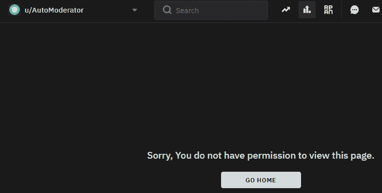

# 蟒蛇 PRAW–解开红色编辑器

> 原文:[https://www . geesforgeks . org/python-praw-unblocking-a-redditor/](https://www.geeksforgeeks.org/python-praw-unblocking-a-redditor/)

在 Reddit 中，redditor 是给用户的术语。在这里，我们将看到如何使用 PRAW 作为经过身份验证的用户解除阻止被阻止的 redditor。我们将使用`Redditor`类的`unblock()`方法来解锁一个 redditor。

## 解除阻止()

> **语法:** Redditor.unblock()
> 
> **参数:**无
> 
> **返回:**无

**例 1 :** 考虑以下未阻塞的 redditor :


redditor 的用户名是:spez

```
# importing the module
import praw

# initialize with appropriate values
client_id = ""
client_secret = ""
username = ""
password = ""
user_agent = ""

# creating an authorized reddit instance
reddit = praw.Reddit(client_id = client_id, 
                     client_secret = client_secret, 
                     username = username, 
                     password = password,
                     user_agent = user_agent) 

# the name of the redditor
redditor_name = "spez"

# instantiating the Redditor class
redditor = reddit.redditor(redditor_name)

# unblocking the redditor
redditor.unblock()
```

**输出:**


**例 2 :** 考虑以下未阻塞的 redditor :


redditor 的用户名是:自动编码器

```
# importing the module
import praw

# initialize with appropriate values
client_id = ""
client_secret = ""
username = ""
password = ""
user_agent = ""

# creating an authorized reddit instance
reddit = praw.Reddit(client_id = client_id, 
                     client_secret = client_secret, 
                     username = username, 
                     password = password,
                     user_agent = user_agent) 

# the name of the redditor
redditor_name = "AutoModerator"

# instantiating the Redditor class
redditor = reddit.redditor(redditor_name)

# unblocking the redditor
redditor.unblock()
```

**输出:**
