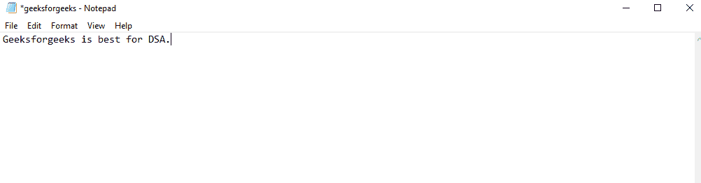
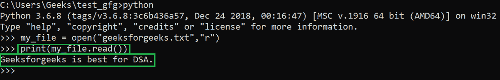

# Python 打印()功能

> 原文:[https://www.geeksforgeeks.org/python-print-function/](https://www.geeksforgeeks.org/python-print-function/)

python print()函数，顾名思义，用于打印 python 中的 python 对象作为标准输出。

> **语法:**打印(对象、阶段、结束、文件、刷新)
> 
> **参数:**
> 
> *   **对象:**可以是任何 python 对象，如字符串、列表、元组等。但是在打印之前，所有的对象都会被转换成字符串。
> *   **sep:** 为可选参数，用于定义不同待打印对象之间的间隔。默认情况下，空字符串("")用作分隔符。
> *   **end:** 是一个可选参数，用于设置要在末尾打印的字符串。默认值设置为换行 *("\n ")。*
> *   **文件:**在文件上或文件上方写入时使用的可选参数。默认情况下，它被设置为产生标准输出作为*系统标准输出*的一部分
> *   **刷新:**设置刷新或缓冲输出是可选的布尔参数。如果设置为真，它将被刷新，否则将被缓冲。默认情况下，它设置为“假”。

### **示例 1:打印 python 对象**

## 蟒蛇 3

```py
# sample python objects
list = [1,2,3]
tuple = ("A","B")
string = "Geeksforgeeks"

# printing the objects
print(list,tuple,string)
```

**输出:**

```py
[1, 2, 3] ('A', 'B') Geeksforgeeks
```

### **示例 2:用分隔符**打印对象

## 蟒蛇 3

```py
# sample python objects
list = [1,2,3]
tuple = ("A","B")
string = "Geeksforgeeks"

# printing the objects
print(list,tuple,string, sep="<<..>>")
```

**输出:**

```py
[1, 2, 3]<<..>>('A', 'B')<<..>>Geeksforgeeks
```

### **例 3:在末尾指定要打印的字符串**

## 蟒蛇 3

```py
# sample python objects
list = [1,2,3]
tuple = ("A","B")
string = "Geeksforgeeks"

# printing the objects
print(list,tuple,string, end="<<..>>")
```

**输出:**

```py
[1, 2, 3] ('A', 'B') Geeksforgeeks<<..>>
```

### **示例 4:打印和读取外部文件的内容**

为此，我们还将使用 Python **打开()函数**，然后打印其内容。我们已经在系统中保存了以下名为*的文本文件*



要阅读和打印此内容，我们将使用以下代码:

## 蟒蛇 3

```py
# open and read the file
 my_file = open("geeksforgeeks.txt","r")

# print the contentts of the file
print(my_file.read())
```

**输出:**



### **示例 5:打印到系统标准错误**

## 蟒蛇 3

```py
# Python code for printing to stderr

# importing the package
# for sys.stderr
import sys

# variables
Company = "Geeksofrgeeks.org"
Location = "Noida"
Email = "contact@geeksforgeeks.org"

# print to stderr
print(Company, Location, Email, file=sys.stderr)
```

**输出:**

```py
Geeksofrgeeks.org Noida contact@geeksforgeeks.org
```