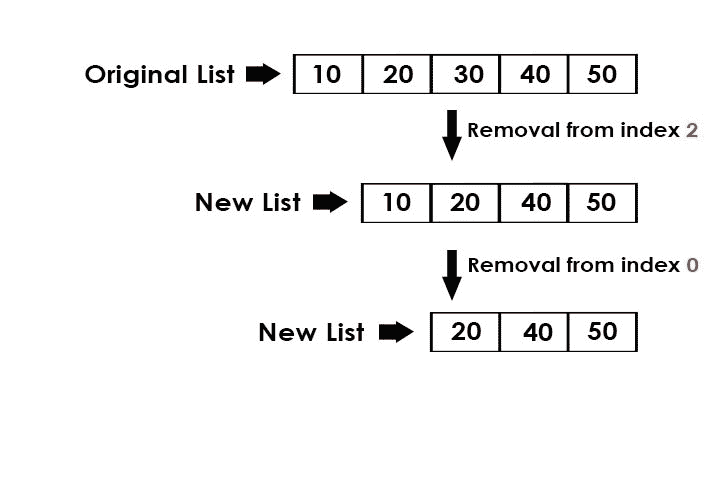

# Python |删除给定索引处的元素后打印列表

> 原文:[https://www . geesforgeks . org/python-print-list-remove-element-given-index/](https://www.geeksforgeeks.org/python-print-list-removing-element-given-index/)

给定一个索引，从列表中移除该索引处的元素并打印新列表。

例:

```py
Input : list = [10, 20, 30, 40, 50] 
        index = 2
Output : [10, 20, 40, 50] 

Input : list = [10, 20, 40, 50] 
        index = 0 
Output : [20, 40, 50] 

```

**方法 1:遍历列表**

使用列表中的遍历，将除给定索引之外的所有索引值追加到新列表中，然后打印新列表。为此，我们将需要一个新的列表，其中我们可以追加除给定索引值之外的所有值。

下面是上述方法的 Python3 实现

```py
# Python3 program to remove the index 
# element from the list 
# using traversal 

def remove(list1, pos):
    newlist = []

    # traverse in the list
    for x in range(len(list1)):

        # if index not equal to pos
        if x != pos:
            newlist.append(list1[x]) 
    print(*newlist)  

# driver code
list1 = [10, 20, 30, 40, 50]
pos = 2
remove(list1, pos)
```

**输出:**

```py
10 20 40 50

```

**方法二:pop()**

[pop()](https://www.geeksforgeeks.org/list-methods-in-python-set-2-del-remove-sort-insert-pop-extend/) 函数帮助我们将参数中传递的值弹出到任何需要的位置，如果参数中没有传递任何内容，那么它会移除最后一个索引值。

下面是上述方法的 Python3 实现:

```py
# Python3 program to remove the index 
# element from the list 
# using pop()

def remove(list1, pos):

    # pop the element at index = pos
    list1.pop(pos) 
    print(*list1)

# driver code
list1 = [10, 20, 30, 40, 50]
pos = 2
remove(list1, pos)
```

**输出:**

```py
10 20 40 50

```

**方法 3:删除功能**

[del](https://www.google.com/url?q=https://www.geeksforgeeks.org/list-methods-in-python-set-2-del-remove-sort-insert-pop-extend/&sa=U&ved=0ahUKEwjUm6aPgaHYAhXIpI8KHdodDX8QFggEMAA&client=internal-uds-cse&cx=009682134359037907028:tj6eafkv_be&usg=AOvVaw2-UDkKMNKMJMyGMoxoEkjH) 功能可用于移除任何给定位置的任何元素。如果在[]括号中给出-1 或-2，则它会分别删除最后一个和第二个最后一个元素。

下面是上述方法的 Python3 实现:

```py
# Python3 program to remove the index element
# from the list using del

def remove(list1, pos):

    # delete the element at index = pos
    del list1[pos] 
    print(*list1)

# driver code
list1 = [10, 20, 30, 40, 50]
pos = 2
remove(list1, pos)
```

**输出:**

```py
10 20 40 50

```