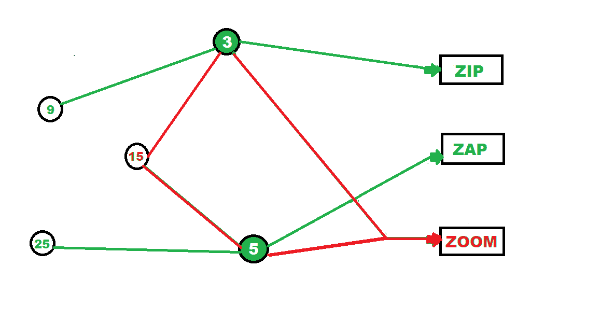

# 用于 Zip、Zap 和 Zoom 游戏的 Python 程序

> 原文:[https://www . geesforgeks . org/python-program-for-zip-zap-zom-game/](https://www.geeksforgeeks.org/python-program-for-zip-zap-and-zoom-game/)

Zip zap zoom 是一款有趣的游戏，需要玩家集中精力，积极参与。当这个游戏与人一起玩时，它是这样玩的:

*   玩家站成一圈，彼此相距 6 英尺
*   一个玩家开始游戏，用拍手的方式指向游戏左边的人，说“嗖嗖”
*   这个人现在对右边的人做同样的事情，说 zap
*   如此选择的第三个人现在可以通过说 zoom 来选择任何人，而不管方向如何
*   现在被选中的人用 zap 再次开始游戏，并以这种方式继续
*   如果有人在游戏重启的间隙搞砸了。

在 Python 编程中，这个游戏将通过以下方法实现。

### 方法

*   接受用户输入的数字。
*   检查数字是否是 3 和 5 的倍数，如果是，则打印“缩放”。
*   如果不是，则检查数字是否是 3 的倍数，如果是，则打印“Zip”。
*   如果是 5 的倍数，则打印“Zap”。
*   否则，打印一个默认语句。

**示例:**

```py
Input:6
Output:
Zip
```

#### 这里有一个简单有趣的例子来描述这一点:



**程序:**

## C++

```py
#include <iostream>
using namespace std;

void zzz(int number)
{
    if (number % 3 == 0 && number % 5 == 0)
        cout << "Zoom\n";
    else if (number % 3 == 0)     
        cout << "Zip\n";
    else if (number % 5 == 0)       
        cout << "Zap\n";
    else
        cout << "Invalid number!\n"; 
}

// Driver code
int main()
{

    // Calling function
    zzz(7);
    zzz(6);
    zzz(5);
    zzz(30);

    return 0;
}

// This code is contributed by svrrrsvr
```

## 蟒蛇 3

```py
def main():
    zzz(7)
    zzz(6)
    zzz(5)
    zzz(30)

def zzz(number):
    if number % 3 == 0 and number % 5 == 0:
        print("Zoom")
    elif number % 3 == 0:
        print("Zip")
    elif number % 5 == 0:
        print("Zap")
    else:
        print("Invalid number!")

main()
```

**输出:**

```py
Invalid number!
Zip
Zap
Zoom
```