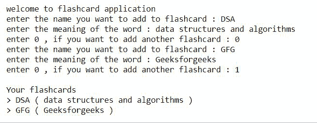
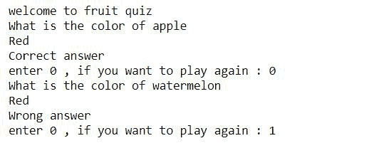

# Python 程序使用 Python 中的类构建抽认卡

> 原文:[https://www . geesforgeks . org/python-程序到构建-flash card-使用 python 中的类/](https://www.geeksforgeeks.org/python-program-to-build-flashcard-using-class-in-python/)

在本文中，我们将看到如何使用 python 中的类构建一个 flashcard。抽认卡是一种两面都有信息的卡片，可以用来辅助记忆。抽认卡通常一边有一个问题，另一边有一个答案。特别是在这篇文章中，我们将创建有单词及其含义的抽认卡。

**我们来看一些抽认卡的例子:**

**例 1:**

**进场:**

*   将单词及其含义作为用户的输入。
*   创建一个名为 flashcard 的类，使用 [__init__()](https://www.geeksforgeeks.org/__init__-in-python/) 函数为单词和含义赋值。
*   现在我们使用 __str__()函数返回包含单词和含义的字符串。
*   将返回的字符串存储在名为 flash 的列表中。
*   使用 while 循环打印所有存储的抽认卡。

**以下是完整实现:**

## 蟒蛇 3

```
class flashcard:
    def __init__(self, word, meaning):
        self.word = word
        self.meaning = meaning
    def __str__(self):

        #we will return a string 
        return self.word+' ( '+self.meaning+' )'

flash = []
print("welcome to flashcard application")

#the following loop will be repeated until
#user stops to add the flashcards
while(True):
    word = input("enter the name you want to add to flashcard : ")
    meaning = input("enter the meaning of the word : ")

    flash.append(flashcard(word, meaning))
    option = int(input("enter 0 , if you want to add another flashcard : "))

    if(option):
        break

# printing all the flashcards 
print("\nYour flashcards")
for i in flash:
    print(">", i)
```

**输出:**



**例 2:**

**进场:**

*   创建一个名为 flashcard 的类。
*   使用 [__init__()](https://www.geeksforgeeks.org/__init__-in-python/) 方法初始化字典水果。
*   现在使用 [choice()](https://www.geeksforgeeks.org/random-choices-method-in-python/) 方法从水果中随机选择一对，将键存储在可变水果中，将值存储在可变颜色中。
*   现在提示用户回答随机选择的水果的颜色。
*   如果打印正确，否则打印错误。

## 蟒蛇 3

```
import random

class flashcard:
    def __init__(self):

        self.fruits={'apple':'red',
                     'orange':'orange',
                     'watermelon':'green',
                     'banana':'yellow'}

    def quiz(self):
        while (True):

            fruit, color = random.choice(list(self.fruits.items()))

            print("What is the color of {}".format(fruit))
            user_answer = input()

            if(user_answer.lower() == color):
                print("Correct answer")
            else:
                print("Wrong answer")

            option = int(input("enter 0 , if you want to play again : "))
            if (option):
                break

print("welcome to fruit quiz ")
fc=flashcard()
fc.quiz()
```

**输出:**

