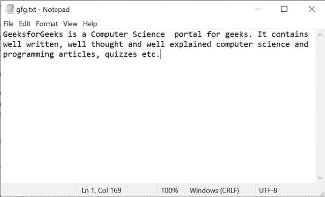

# Python 程序将文件中每个单词的第一个字母大写

> 原文:[https://www . geesforgeks . org/python-program-to-大写文件中每个单词的第一个字母/](https://www.geeksforgeeks.org/python-program-to-capitalize-the-first-letter-of-every-word-in-the-file/)

下面的文章包含了读取一个文件，将文件中每个单词的第一个字母大写，并将其作为输出打印出来的程序。为了大写第一个字母，我们将使用 python 中的 [**title()函数**](https://www.geeksforgeeks.org/title-in-python/#:~:text=Title%20function%20in%20python%20is,which%20we%20need%20to%20convert.) 。python 中的 title 函数是 Python String 方法，用于将每个单词中的第一个字符转换为大写，将字符串中的其余字符转换为小写，并返回新字符串。

**示例:**

```
# Content of the file serves as input
Input: hello world
Output: Hello World

# Content of the file serves as input
Input: geeks for geeks
Output: Geeks For Geeks

```

**进场:**

*   我们将把文件的内容作为输入。
*   我们将使用 python 中的 [**open()函数**](https://www.geeksforgeeks.org/open-a-file-in-python/) 打开文件并保存其内容。
*   修改后打印内容。

**输入文件:**



gfg.txt 文件的内容

下面是实现。

## 蟒蛇 3

```
# Python program to read a file and capitalize
# the first letter of every word in the file.

# A file named "gfg", will be opened with the 
# reading mode. 
file_gfg = open('gfg.txt', 'r')

# This will traverse through every line one by one
# in the file
for line in file_gfg:

    # This will convert the content
    # of that line with capitalized
    # first letter of every word
    output = line.title()

    # This will print the output
    print(output)
```

**输出:**

> 极客是极客的计算机科学门户。它包含写得好、想得好、解释得好的计算机科学和编程文章、测验等。