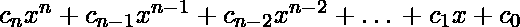

# 计算多项式方程的 Python 程序

> 原文:[https://www . geesforgeks . org/python-程序到计算-多项式-方程/](https://www.geeksforgeeks.org/python-program-to-compute-a-polynomial-equation/)

下面的文章包含计算多项式方程的程序，假设多项式的系数存储在一个列表中。

**示例:**

```
# Evaluate value of 2x3 - 6x2 + 2x - 1 for x = 3
Input: poly[] = {2, -6, 2, -1}, x = 3
Output: 5

# Evaluate value of 2x3 + 3x + 1 for x = 2
Input: poly[] = {2, 0, 3, 1}, x = 2
Output: 23

# Evaluate value of 2x + 5 for x = 5
Input: poly[] = {2, 5}, x = 5
Output: 15

```

该方程的类型为:



我们将得到变量的值，并且我们必须在那个点计算多项式的值。为此，我们有两种方法。

### 方法

*   **天真法:**用 for 循环计算值。
*   **优化方法:**使用[霍纳方法](https://www.geeksforgeeks.org/horners-method-polynomial-evaluation/)计算数值。

**天真法:**

在这种方法中，将遵循以下方法。这是做这类题最幼稚的做法。

*   第一个系数**c<sub>n</sub>T3】将乘以**x<sup>n</sup>T7】****
*   那么系数 **c <sub>n-1</sub>** 将乘以 **x <sup>n-1</sup>**
*   将添加以上两个步骤中产生的结果
*   这将一直持续到所有系数都被覆盖。

**示例:**

## 蟒蛇 3

```
# 2x3 - 6x2 + 2x - 1 for x = 3
poly = [2, -6, 2, -1]
x = 3
n = len(poly)

# Declaring the result
result = 0

# Running a for loop to traverse through the list
for i in range(n):

    # Declaring the variable Sum
    Sum = poly[i]

    # Running a for loop to multiply x (n-i-1)
    # times to the current coefficient
    for j in range(n - i - 1):
        Sum = Sum * x

    # Adding the sum to the result
    result = result + Sum

# Printing the result
print(result)
```

**输出:**

```
5

```

**时间复杂度:** O(n <sup>2</sup>

**优化方法:**

[霍纳方法](https://en.wikipedia.org/wiki/Horner%27s_method)可用于求 O(n)时间内的多项式。为了理解方法，让我们考虑 2x<sup>3</sup>–6x<sup>2</sup>+2x–1 的例子。多项式可以计算为((2x–6)x+2)x–1。想法是将结果初始化为 x <sub>n</sub> 的系数，在这种情况下是 2，将结果与 x 重复相乘，并将下一个系数加到结果上。最后，返回结果。

## 蟒蛇 3

```
# + poly[1]x(n-2) + .. + poly[n-1]
def horner(poly, n, x):

    # Initialize result
    result = poly[0]

    # Evaluate value of polynomial
    # using Horner's method
    for i in range(1, n):

        result = result*x + poly[i]

    return result

# Driver program to
# test above function.

# Let us evaluate value of
# 2x3 - 6x2 + 2x - 1 for x = 3
poly = [2, -6, 2, -1]
x = 3
n = len(poly)

print("Value of polynomial is:", horner(poly, n, x))
```

**输出:**

```
Value of polynomial is: 5

```

**时间复杂度:** O(n)