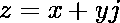
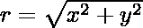

# Python 程序将复数转换为极坐标

> 原文:[https://www . geesforgeks . org/python-程序-将复数转换为极坐标/](https://www.geeksforgeeks.org/python-program-to-convert-complex-numbers-to-polar-coordinates/)

在开始程序之前，让我们先看看极坐标的基础知识，然后使用 Python 的 cmath 和 abs 模块进行转换。极坐标只是表示笛卡尔坐标或复数的一种不同方式。复数 z 定义为:



它完全由其实部 x 和虚部 y 决定，这里，j 是虚部。

极坐标(r，φ)完全由模数 r 和相角φ决定。

**在哪里，**

*   **r:**z 到原点的距离，即，



*   **φ:** 从正 x 轴到连接 z 和原点的线段的逆时针角度。

下面举例说明复数到极坐标的转换。

## 使用 cmath 模块

Python 的 cmath 模块提供了对复数数学函数的访问。它包含几个用于将坐标从一个域转换到另一个域的函数。

其中一些被解释为-

**1 .cmath.polar(x):**

返回 x 在极坐标中的表示。cmath.polar()函数用于将复数转换为极坐标。

## 蟒蛇 3

```
# Python code to implement 
# the polar()function 

# importing "cmath" 
# for mathematical operations 
import cmath 

# using cmath.polar() method 
num = cmath.polar(1) 
print(num)
```

**Output**

```
(1.0, 0.0)

```

**2。cmath.phase (z):** 这个方法返回复数 z 的相位(也称为 z 的自变量)。

## 蟒蛇 3

```
import cmath

x = -1.0
y = 0.0
z = complex(x,y); 

# printing phase of a complex number using phase() 
print ("The phase of complex number is : ",end="") 
print (cmath.phase(z)) 
```

**Output**

```
The phase of complex number is : 3.141592653589793

```

## 使用 abs()

**abs():** 此方法返回复数 z 的模(绝对值)。

## 蟒蛇 3

```
num1 = 3 + 4j
print('Absolute value of 3 + 4j is:', abs(num1))
```

**Output**

```
Absolute value of 3 + 4j is: 5.0

```

给你一个复数 z，你的任务是把它转换成极坐标。

**我们把一个复数看成 1+5j，需要把它转换成极坐标。**

## 蟒蛇 3

```
import cmath

c = complex(1+5j)
print(abs(c))
```

**Output**

```
5.0990195135927845

```