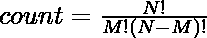

# 计算非弹性数字的 Python 程序

> 原文:[https://www . geesforgeks . org/python-程序到计数-非弹性数字/](https://www.geeksforgeeks.org/python-program-to-count-non-bouncy-numbers/)

如果任何数字的表示方式是，当我们从左到右阅读时，第 I<sup>位大于或等于第 i-1 <sup>位</sup>位的数字称为递增数。如果任何数字的位数从左向右递减，这就是所谓的递减数</sup>

**示例:**

> **增加数量？235668**
> 
> 从左到右的所有数字都大于或等于前一个数字。
> 
> **递减数？653221**
> 
> 从左到右的所有数字都小于或等于前一个数字。

但如果数字既不增加也不减少，则称为**弹性数字**。

**示例:**

> **523469 - >** 从左到右的部分位数从左到右递减，部分位数递增。这是弹性号码的例子。

本文的任务是统计 10 <sup>k</sup> 以下的非弹跳数总数，并在 mod(10 <sup>9</sup> +7)中打印最终计数。为此，我们将使用星条旗法来计算给定范围内非弹性数字的数量。

**星条旗法:**

星条旗法是一种用于处理基于组合的问题的技术。当我们想要相同组的数量时，就会出现这类问题。

**同群计算公式:**


其中 N 是相同的物体，M 是容器或范围。

**最终公式:**


**示例:**

```
Input : k = 6
Output : 12951

Input : k = 9
Output : 140906
```

下面是实现:

## 蟒蛇 3

```
# import redunce function from functools
from functools import reduce

# define a function to
# calculate nCr
def nCr(n, k):

  # this approach is based on
  # approach of stars and bar method
  # using reduce and lambda function
  # to calculate number & denom
  number = reduce(lambda x, y: x * y,
                 list(range(n, n - k, -1)))   
  denom = reduce(lambda x, y: x * y,
                 list(range(1, k + 1)))       

  #  denom root of number will be the final result
  return number // denom       

# Driver Code
# input value of k
k = 6 

# calculating r using function call
r = int((nCr(k + 10, 10) +
         nCr(k + 9, 9)
         - 2 - 10 * k))

# print final result
print(r % (1000000000 + 7))       
```

**输出:**

```
12951
```