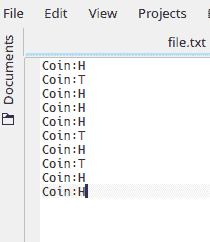
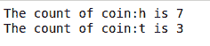

# 计算文本文件中键值对出现次数的 Python 程序

> 原文:[https://www . geesforgeks . org/python-program-to-count-出现次数-文本文件中的键值对/](https://www.geeksforgeeks.org/python-program-to-count-the-number-of-occurrences-of-a-key-value-pair-in-a-text-file/)

给定键值对的文本文件。任务是统计文件中键值对的出现次数。

**示例:**

```
Input File:
Coin:H
Coin:T
Coin:H
Coin:H
Coin:H
Coin:T
Coin:H
Coin:T
Coin:H
Coin:H

Output:
The count of coin:h is 7
The count of coin:t is 3

Input File:
geeks:G
for:F
geeks:G
geeks:G
geek:H
for:F
geek:H

Output:
The count of geeks:g is 3
The count of for:f is 2
The count of geek:h is 2

```

方法很简单。维护另一个字典(比如 d)，它将存储文件中每个键值对的出现次数。将文本文件的键值对作为关键字存储在字典中。现在遍历文件的键值对。如果该对出现在字典中，则将该对的值增加 1，否则插入该对并将其值设置为 1。

下面是实现。

**文本文件:**



```
# Python program to count the
# occurrences of key-value pair
# in the text file

# opening text file
f = open("file.txt", "r")
d = dict()

for res in f:
    # removing new line and extra
    # space characters
    res = res.strip()

    # changing ase to prevent matching
    # errors
    res = res.lower()

    # separating key-value pairs
    lines = res.split()

    for line in lines:

        if line in d:

            # If the key-value pair
            # is present in d then 
            # increment its value by one
            d[line] = d[line]+1
        else:

            # Insert the key-value pair
            # in the dictionary and sets
            # its value to one
            d[line] = 1

f.close()

# Printing Result
for key in list(d.keys()):
    print("The count of {} is {}".format(key,d[key]))
```

**输出:**

