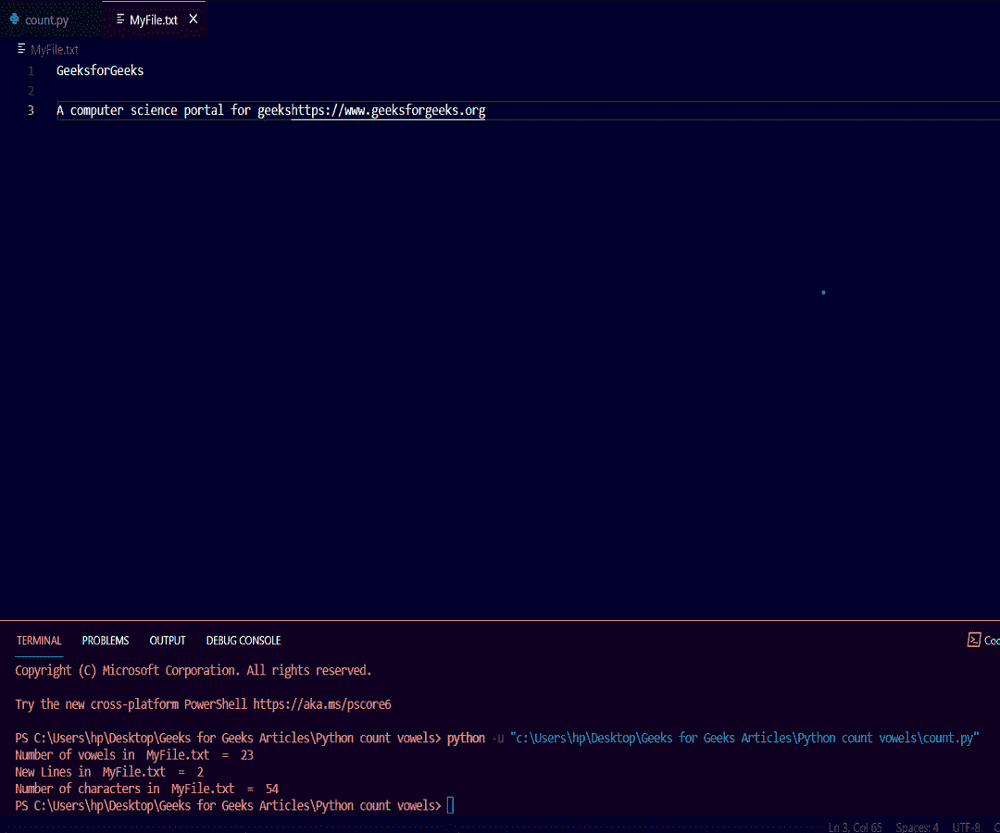

# Python 程序统计文本文件中的元音、行、字符

> 原文:[https://www . geesforgeks . org/python-程序-计数-元音-行-文本中的字符-文件/](https://www.geeksforgeeks.org/python-program-to-count-vowels-lines-characters-in-text-file/)

在本文中，我们将创建一个 python 程序，计算特定文本文件中出现的元音、行和一些字符。

## 方法

*   我们必须使用 python 中的 **open()** 函数打开文件。
*   然后制作元音、行和字符三个变量，分别统计元音、行和字符的个数。
*   列一个元音表，这样我们就可以检查这个字符是否是元音。
*   当计数达到' \n '字符时，我们必须增加行变量，这意味着文件中有一个新行。
*   之后，迭代文件的字符，并计算元音、行和字符。

## 以下是完整的实现:

## 蟒蛇 3

```py
# Python program to count number of vowels,
# newlines and character in textfile

def counting(filename):

    # Opening the file in read mode
    txt_file = open(filename, "r")

    # Initialize three variables to count number of vowels,
    # lines and characters respectively
    vowel = 0
    line = 0
    character = 0

    # Make a vowels list so that we can
    # check whether the character is vowel or not
    vowels_list = ['a', 'e', 'i', 'o', 'u',
                   'A', 'E', 'I', 'O', 'U']

    # Iterate over the characters present in file
    for alpha in txt_file.read():

        # Checking if the current character is vowel or not
        if alpha in vowels_list:
            vowel += 1

        # Checking if the current character is
        # not vowel or new line character
        elif alpha not in vowels_list and alpha != "\n":
            character += 1

        # Checking if the current character
        # is new line character or not
        elif alpha == "\n":
            line += 1

    # Print the desired output on the console.
    print("Number of vowels in ", filename, " = ", vowel)
    print("New Lines in ", filename, " = ", line)
    print("Number of characters in ", filename, " = ", character)

# Calling the function counting which gives the desired output
counting('Myfile.txt')
```

**输出:**

```py
Number of vowels in  MyFile.txt  =  23    
New Lines in  MyFile.txt  =  2
Number of characters in  MyFile.txt  =  54
```

**文本文件:**

