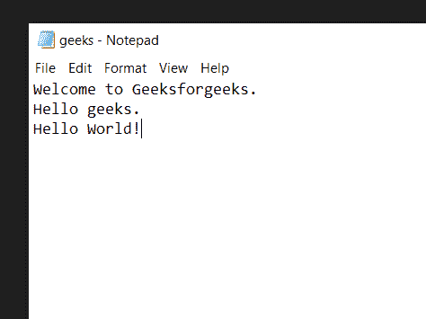
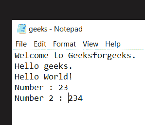

# Python 程序对文本文件进行字数统计

> 原文:[https://www . geesforgeks . org/python-程序到文本文件字数/](https://www.geeksforgeeks.org/python-program-to-count-words-in-text-file/)

在本文中，我们将看到如何使用 Python 对文本文件中的单词进行计数。

### 示例 1:统计字符串单词

首先，我们创建一个文本文件，我们要计算它的字数。假设这个文件是 SampleFile.txt，包含以下内容:

#### **文件为**演示 **:**



#### **下面是实现:**

## 蟒蛇 3

```
# creating variable to store the
# number of words
number_of_words = 0

# Opening our text file in read only
# mode using the open() function
with open(r'SampleFile.txt','r') as file:

    # Reading the content of the file
    # using the read() function and storing
    # them in a new variable
    data = file.read()

    # Splitting the data into separate lines
    # using the split() function
    lines = data.split()

    # Adding the length of the
    # lines in our number_of_words
    # variable
    number_of_words += len(lines)

# Printing total number of words
print(number_of_words)
```

**输出:**

```
7
```

**说明:**

*   创建一个新变量来存储文本文件中的总字数。然后使用 open()函数以只读模式打开文本文件。
*   使用 Read()函数读取文件的内容，并将它们存储在一个新的变量中。然后使用 split()函数将存储在数据变量中的数据拆分成单独的行，然后将它们存储在新的变量中。并在我们的字数变量中加上行的长度。

### 示例 2:计算字数，而不是整数

**演示文件:**



**下面是实现:**

## 蟒蛇 3

```
# creating variable to store the
# number of words
number_of_words = 0

# Opening our text file in read only
# mode using the open() function
with open(r'SampleFile.txt','r') as file:

    # Reading the content of the file
    # using the read() function and storing
    # them in a new variable
    data = file.read()

    # Splitting the data into separate lines
    # using the split() function
    lines = data.split()

    # Iterating over every word in
    # lines
    for word in lines:

        # checking if the word is numeric or not
        if not word.isnumeric():         

            # Adding the length of the
            # lines in our number_of_words
            # variable
            number_of_words += 1

# Printing total number of words
print(number_of_words)
```

**输出:**

```
11
```

**说明:**创建一个新的变量来存储文本文件中的总字数，然后使用 open()函数以只读模式打开文本文件。使用 Read()函数读取文件的内容，并将其存储在一个新的变量中，然后使用 split()函数将存储在数据变量中的数据拆分成单独的行，然后将其存储在一个新的变量中，使用 for 循环对行中的每个单词进行迭代，并使用 is numeric()函数检查该单词是否是数字，然后在我们的 number_of_words 变量中添加 1。