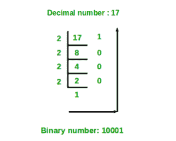

# Python 程序将十进制数转换为二进制数

> 原文:[https://www . geesforgeks . org/python-程序到隐蔽-十进制到二进制-数字/](https://www.geeksforgeeks.org/python-program-to-covert-decimal-to-binary-number/)

给定一个十进制数作为输入，任务是编写一个 Python 程序，将给定的十进制数转换为等价的二进制数。
**例:**

```py
Input : 7                                                         
Output :111

Input :10
Output :1010
```

**方法#1:** 递归求解

```py
DecimalToBinary(num):
        if num >= 1:
            DecimalToBinary(num // 2)
           print num % 2 
```



下面是上述递归解决方案的实现:

## 蟒蛇 3

```py
# Function to convert decimal number
# to binary using recursion
def DecimalToBinary(num):

    if num >= 1:
        DecimalToBinary(num // 2)
    print(num % 2, end = '')

# Driver Code
if __name__ == '__main__':

    # decimal value
    dec_val = 24

    # Calling function
    DecimalToBinary(dec_val)
```

**Output**

```py
011000
```

**方法 2:** 使用内置函数将十进制转换为二进制

## 蟒蛇 3

```py
# Python program to convert decimal to binary

# Function to convert Decimal number
# to Binary number
def decimalToBinary(n):
    return bin(n).replace("0b", "")

# Driver code
if __name__ == '__main__':
    print(decimalToBinary(8))
    print(decimalToBinary(18))
    print(decimalToBinary(7))
```

**Output**

```py
1000
10010
111
```

**方法#3:** 无内置功能

## 蟒蛇 3

```py
# Python program to convert decimal to binary

# Function to convert Decimal number
# to Binary number
def decimalToBinary(n):
    return "{0:b}".format(int(n))

# Driver code
if __name__ == '__main__':
    print(decimalToBinary(8))
    print(decimalToBinary(18))
    print(decimalToBinary(7))
```

**输出**

```py
1000
10010
111
```