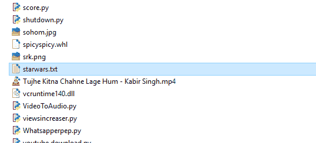
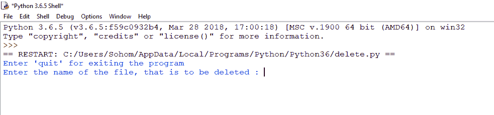
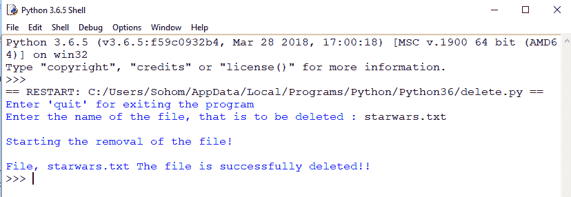
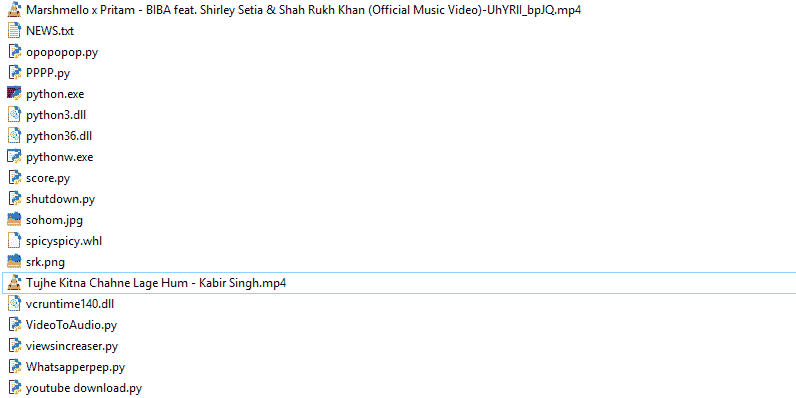
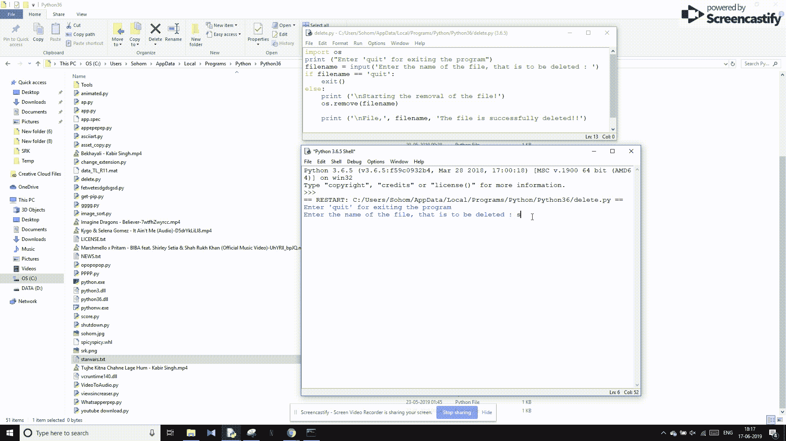

# Python 程序删除文件

> 原文:[https://www . geesforgeks . org/python-program-to-delete-a-file/](https://www.geeksforgeeks.org/python-program-to-delete-a-file/)

有没有想过用几行代码从 Python 程序中删除一个文件？你来对地方了。今天我们将学习如何使用 Python 删除文件。

**注意:**我们将导入 os 库，并使用 os.remove()函数删除所需的文件。如果没有操作系统库，那么打开**命令提示符**并编写 **pip 安装操作系统**，安装所需的操作系统库。

下面是 Python 实现–

```py
import os
print ("Enter 'quit' for exiting the program")
filename = input('Enter the name of the file, that is to be deleted : ')
if filename == 'quit':
    exit()
else:
    print ('\nStarting the removal of the file !')
    os.remove(filename)

    print ('\nFile, ', filename, 'The file deletion is successfully completed !!')

```

**输出:**
**需要删除的文件:**


**程序运行示例**


**当我们输入要删除的文件名称时:**


**删除:**


**工作:**
