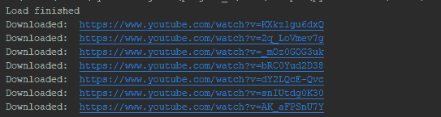

# Python |程序下载完整的 Youtube 播放列表

> 原文:[https://www . geesforgeks . org/python-程序-下载-完成-YouTube-播放列表/](https://www.geeksforgeeks.org/python-program-to-download-complete-youtube-playlist/)

Python 是一种多用途编程语言，广泛用于编写小型任务的脚本。让我们看看如何使用 Python 制作自己的 Youtube 播放列表下载器。虽然市场上有很多软件，但是让自己的软件服务于这个目的是一门学问，也是令人印象深刻的。

**所需模块:**

*   帅呆了 bs4
*   PyQt5
*   PyQtWebEngine
*   系统模块
*   urllib 模块
*   pytube 模块

### **它是如何工作的**？****

从一个 YouTube 播放列表的给定网址，我们的程序将执行网页抓取，获取所有的 YouTube 视频链接，并将其附加在一个链接数组下。然后使用 **pytube** 库，我们将从 links 数组中的链接下载相应的 YouTube 视频。下载 YouTube 视频的参数(质量、mime_type 等)可以在 streams 构造函数中指定。视频将以原始视频的名称下载。

**让我们看看代码:**

## 蟒蛇 3

```py
# Importing libraries
import bs4 as bs
import sys
import urllib.request
from PyQt5.QtWebEngineWidgets import QWebEnginePage
from PyQt5.QtWidgets import QApplication
from PyQt5.QtCore import QUrl
import pytube  # library for downloading youtube videos

class Page(QWebEnginePage):
    def __init__(self, url):
        self.app = QApplication(sys.argv)
        QWebEnginePage.__init__(self)
        self.html = ''
        self.loadFinished.connect(self._on_load_finished)
        self.load(QUrl(url))
        self.app.exec_()

    def _on_load_finished(self):
        self.html = self.toHtml(self.Callable)
        print('Load finished')

    def Callable(self, html_str):
        self.html = html_str
        self.app.quit()

links = []

def exact_link(link):
    vid_id = link.split('=')
    # print(vid_id)
    str = ""
    for i in vid_id[0:2]:
        str += i + "="

    str_new = str[0:len(str) - 1]
    index = str_new.find("&")

    new_link = "https://www.youtube.com" + str_new[0:index]
    return new_link

url = "https://www.youtube.com/watch?v=lcJzw0JGfeE&list=PLqM7alHXFySENpNgw27MzGxLzNJuC_Kdj"
# Scraping and extracting the video
# links from the given playlist url
page = Page(url)
count = 0

soup = bs.BeautifulSoup(page.html, 'html.parser')
for link in soup.find_all('a', id='thumbnail'):

    # not using first link because it is
    # playlist link not particular video link
    if count == 0:
        count += 1
        continue
    else:
        try:
              # Prevents error for links with no href.
            vid_src = link['href']
            # print(vid_src)
            # keeping the format of link to be
            # given to pytube otherwise in some cases
            new_link = exact_link(vid_src)

            # error might occur due to this
            # print(new_link)

            # appending the link to the links array
            links.append(new_link)
        except Exception as exp:
            pass # No function necessary for invalid <a> tags.

# print(links)

# downloading each video from
# the link in the links array
for link in links:
    yt = pytube.YouTube(link)

    # Downloaded video will be the best quality video
    stream = yt.streams.filter(progressive=True,
                               file_extension='mp4').order_by(
        'resolution').desc().first()
    try:
        stream.download()
        # printing the links downloaded
        print("Downloaded: ", link)
    except:
        print('Some error in downloading: ', link)
```

**输出:**

