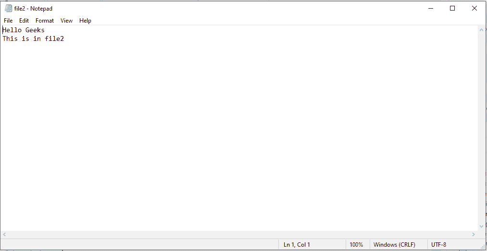

# Python 程序将两个文件合并成第三个文件

> 原文:[https://www . geesforgeks . org/python-程序-将两个文件合并成第三个文件/](https://www.geeksforgeeks.org/python-program-to-merge-two-files-into-a-third-file/)

**先决条件:** [读写文件。](https://www.geeksforgeeks.org/reading-writing-text-files-python/)

让给定的两个文件分别为`file1.txt` 和`file2.txt`。我们的任务是将两个文件合并成第三个文件，比如 file3.txt。

1.  以读取模式打开 file1.txt 和 file2.txt。
2.  以写模式打开 file3.txt。
3.  从文件 1 中读取数据，并将其添加到字符串中。
4.  从文件 2 读取数据，并将该文件的数据连接到前一个字符串。
5.  将字符串中的数据写入文件 3
6.  关闭所有文件

**注意:**要成功运行下面的程序，file1.txt 和 file2.txt 必须存在于同一个文件夹中。

假设文本文件`file1.txt` 和`file2.txt`包含以下数据。

**file1.txt**


**文件**T2

下面是实现。

```py
# Python program to
# demonstrate merging
# of two files

data = data2 = ""

# Reading data from file1
with open('file1.txt') as fp:
    data = fp.read()

# Reading data from file2
with open('file2.txt') as fp:
    data2 = fp.read()

# Merging 2 files
# To add the data of file2
# from next line
data += "\n"
data += data2

with open ('file3.txt', 'w') as fp:
    fp.write(data)
```

**输出:**


#### 用于循环

使用 for 循环可以缩短上述方法。以下是合并的步骤。

1.  创建包含文件名的列表。
2.  以写入模式打开文件 3。
3.  遍历列表，并以读取模式打开每个文件。
4.  从文件中读取数据，同时将数据写入文件 3。
5.  关闭所有文件

下面是实现。

```py
# Python program to
# demonstrate merging of
# two files

# Creating a list of filenames
filenames = ['file1.txt', 'file2.txt']

# Open file3 in write mode
with open('file3.txt', 'w') as outfile:

    # Iterate through list
    for names in filenames:

        # Open each file in read mode
        with open(names) as infile:

            # read the data from file1 and
            # file2 and write it in file3
            outfile.write(infile.read())

        # Add '\n' to enter data of file2
        # from next line
        outfile.write("\n")
```

**输出:**
