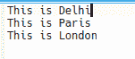
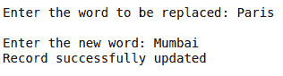
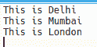

# Python 程序修改一个二进制文件的内容

> 原文:[https://www . geesforgeks . org/python-程序修改二进制文件内容/](https://www.geeksforgeeks.org/python-program-to-modify-the-content-of-a-binary-file/)

给定一个包含一些句子(空格分隔的单词)的二进制文件，让我们编写一个 Python 程序来修改或更改句子中的任何特定单词。

**方法:**
**步骤 1:** 在二进制文件中搜索单词。
**步骤 2:** 在文件中搜索时，变量“pos”存储文件指针记录的位置，然后遍历(继续)读取该记录。
**步骤 3:** 如果要搜索的单词存在，则将写指针(指向前一条记录的结尾)放在 pos 处。
**第四步:**调用 write()函数取新记录。
**第五步:**在“pos”位置写入新对象，记录更新，打印“记录更新成功”。
**第 6 步:**如果该词不存在，则打印“未找到记录”。

**实现**
我们假设二进制文件的内容是:



## 蟒蛇 3

```
# Python program to modify the
# content of binary file

# Function to update the
# content of binary file
def update_binary(word, new)
    # string variable to store
    # each word after reading
    # from the file
    string = b""

    # Flag variable to check
    # if the record is found or
    # not
    Flag = 0

    # Open the file in r + b mode which means
    # opening a binary file for reading and
    # writing
    with open('file.txt', 'r + b') as file:

        pos = 0

        # Reading the content of the
        # file character by character
        data = string = file.read(1)

        # Looping till the end of
        # file is reached
        while data:
            data = file.read(1)

            # Checking if the space is reached
            if data == b" ":

                # checking the word read with
                # the word entered by user
                if string == word:

                    # Mpving the file pointer
                    # at the end of the previously
                    # read record
                    file.seek(pos)

                    # Updating the content of the file
                    file.write(new)
                    Flag = 1
                    break
                else:
                    # storing the position of
                    # current file pointer i.e. at
                    # the end of previously read record
                    pos = file.tell()
                    data = string = file.read(1)
            else:

                # Storing the data of the file
                # in the string variable
                string += data
                continue

    if Flag:
        print("Record successfully updated")
    else:
        print("Record not found")

# Driver code
# Input the word to be found
# and the new word
word = input("Enter the word to be replaced: ").encode()
new = input("\nEnter the new word: ").encode()

update_binary(word, new)
```

**输出:**



**文本文件:**

