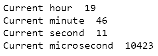
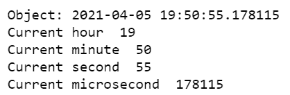

# Python 程序打印当前小时、分钟、秒和微秒

> 原文:[https://www . geesforgeks . org/python-program-to-print-current-小时-分-秒-微秒/](https://www.geeksforgeeks.org/python-program-to-print-current-hour-minute-second-and-microsecond/)

在本文中，我们将讨论如何使用 Python 打印当前的小时、分钟、秒和微秒。为了打印小时、分钟和微秒，我们需要使用 Python 中的 [DateTime](https://www.geeksforgeeks.org/python-datetime-module-with-examples/) 模块。

### **使用的方法**

*   **datetime.now()。hour():** 此方法返回 datetime 对象的当前小时值。
*   **datetime.now()。minute():** 此方法返回 datetime 对象的当前分钟值。
*   **datetime.now()。second():** 此方法返回 datetime 对象的当前第二个值。
*   **datetime.now()。微秒():**此方法返回 datetime 对象的当前微秒值。

下面是使用示例的各种实现，这些示例描述了如何在 python 中打印当前的小时、分钟、秒和微秒。

**示例 1:** 打印时间、小时、分钟、秒和微秒

## 蟒蛇 3

```py
# importing datetime module
from datetime import datetime 

# now is a method in datetime module is
# used to retrieve current data,time
myobj = datetime.now()

# printing current hour using hour
# class
print("Current hour ", myobj.hour) 

# printing current minute using minute
# class
print("Current minute ", myobj.minute)

# printing current second using second
# class
print("Current second ", myobj.second)

# printing current microsecond using
# microsecond class
print("Current microsecond ", myobj.microsecond)
```

**输出:**



**例 2:** 打印对象，时间，小时，分，秒，微秒。

## 蟒蛇 3

```py
# importing datetime module
from datetime import datetime 

# now is a method in datetime module is
# used to retrieve current data,time
myobj = datetime.now()

# printing the object itself
print("Object:", myobj)

# printing current hour using hour
# class
print("Current hour ", myobj.hour) 

# printing current minute using minute
# class
print("Current minute ", myobj.minute)

# printing current second using second
# class
print("Current second ", myobj.second)

# printing current microsecond using microsecond
# class
print("Current microsecond ", myobj.microsecond)
```

**输出:**

