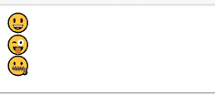
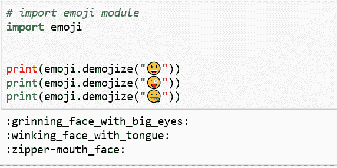

# Python 程序打印表情符号

> 原文:[https://www . geesforgeks . org/python-程序转打印-表情符号/](https://www.geeksforgeeks.org/python-program-to-print-emojis/)

有多种方法可以用 Python 打印表情符号。让我们看看如何打印带有 Uniocdes、CLDR 名字和`emoji` 模块的表情符号。

**使用 Unicode:**
每个表情符号都有一个与之关联的 Unicode。表情符号还有一个 CLDR 简称，也可以用。

从 unicodes 列表中，将“+”替换为“000”。例如–“U+1f 600”将变成“U0001F600”，并在 unicode 前加上“\”并打印出来。

## 蟒蛇 3

```
# grinning face
print("\U0001f600")

# grinning squinting face
print("\U0001F606")

# rolling on the floor laughing
print("\U0001F923")
```

**输出:**


**使用 CLDR 简称:**

## 蟒蛇 3

```
# grinning face
print("\N{grinning face}")

# slightly smiling face
print("\N{slightly smiling face}")

# winking face
print("\N{winking face}")
```

**输出:**


**使用表情模块:**

表情符号也可以使用 Python 中提供的表情模块来实现。要安装它，请在终端中运行以下命令。

```
pip install emoji
```

`emojize()`函数要求在其中传递 CLDR 简称作为参数。然后它返回相应的表情符号。将 CLDR 简称中的空格替换为下划线。

## 蟒蛇 3

```
# import emoji module 
import emoji

print(emoji.emojize(":grinning_face_with_big_eyes:"))
print(emoji.emojize(":winking_face_with_tongue:"))
print(emoji.emojize(":zipper-mouth_face:"))
```

**输出:**


`demojize()`功能将传递的表情符号转换为其对应的 CLDR 简称。


下面是一些常见的带有 CLDR 短名的表情符号:

| CLDR 简称 | 统一码 |
| --- | --- |
| 憔悴的脸 | U+1F600 |
| 大眼睛的瘦脸 | U+1F603 |
| 带着微笑的眼睛的笑脸 | U+1F604 |
| 笑容满面的脸和微笑的眼睛 | U+1F601 |
| 咧着嘴眯着眼的脸 | U+1F606 |
| 汗流满面 | U+1F605 |
| 笑着在地板上打滚 | U+1F923 |
| 喜极而泣 | U+1F602 |
| 微微微笑的脸 | U+1F642 |
| 颠倒的脸 | U+1F643 |
| 眨眼的脸 | U+1F609 |
| 带着微笑的眼睛的笑脸 | U+1F60A |
| 带光环的笑脸 | U+1F607 |
| 三颗心的笑脸 | U+1F970 |
| 心形眼睛的笑脸 | U+1F60D |
| 对名人着迷的 | U+1F929 |
| 吹着吻的脸 | U+1F618 |
| 接吻脸 | U+1F617 |
| 笑脸 | U+263A |
| 闭着眼睛亲吻脸 | U+1F61A |
| 用微笑的眼睛亲吻脸 | U+1F619 |
| 品尝食物的脸 | U+1F60B |
| 用舌头面对 | U+1F61B |
| 用舌头眨眼 | U+1F61C |
| 滑稽的脸 | U+1F92A |
| 用舌头喷脸 | U+1F61D |
| 金钱嘴脸 | U+1F911 |
| 拥抱脸 | U+1F917 |
| 用手捂住嘴 | U+1F92D |
| 嘘嘘脸 | U+1F92B |
| 思考脸 | U+1F914 |
| 拉链嘴脸 | U+1F910 |
| 扬起眉毛的脸 | U+1F928 |
| 中性面 | U+1F610 |
| 面无表情的脸 | U+1F611 |
| 没有嘴的脸 | U+1F636 |
| 傻笑的脸 | U+1F60F |
| 未修饰的脸 | U+1F612 |
| 眼珠转动的脸 | U+1F644 |
| 鬼脸 | U+1F62C |
| 说谎的脸 | U+1F925 |
| 宽慰的脸 | U+1F60C |
| 忧郁的脸 | U+1F614 |
| 困倦的脸 | U+1F62A |
| 流口水的脸 | U+1F924 |
| 睡觉的脸 | U+1F634 |
| 带医用口罩的脸 | U+1F637 |
| 带温度计的脸 | U+1F912 |
| 头带绷带的脸 | U+1F915 |
| 恶心的脸 | U+1F922 |