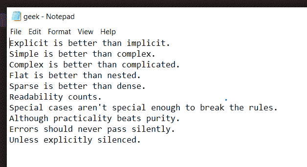
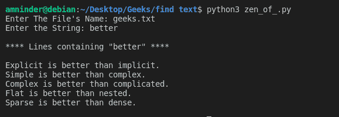

# Python 程序打印文件中包含给定字符串的行

> 原文:[https://www . geesforgeks . org/python-程序到打印行-包含给定字符串的文件/](https://www.geeksforgeeks.org/python-program-to-print-lines-containing-given-string-in-file/)

在本文中，我们将看到如何从给定的文本文件中获取并显示包含给定字符串的行。假设您有一个名为 **geeks.txt** 的文本文件保存在您要创建 python 文件的位置。

**以下是 geeks.txt 文件的内容:**



**进场:**

*   将文本文件加载到 python 程序中，以在文件中找到给定的字符串。
*   要求用户输入要在文件中搜索的字符串。
*   使用**readline()**函数逐行读取文本文件，并搜索字符串。
*   找到字符串后，打印整行并继续搜索。
*   如果在整个文件中没有找到该字符串，则显示正确的结果。

**下面是实现:**

## 蟒蛇 3

```py
# Python Program to Print Lines
# Containing Given String in File

# input file name with extension
file_name = input("Enter The File's Name: ")

# using try catch except to
# handle file not found error.

# entering try block
try:

    # opening and reading the file 
    file_read = open(file_name, "r")

    # asking the user to enter the string to be 
    # searched
    text = input("Enter the String: ")

    # reading file content line by line.
    lines = file_read.readlines()

    new_list = []
    idx = 0

    # looping through each line in the file
    for line in lines:

        # if line have the input string, get the index 
        # of that line and put the
        # line into newly created list 
        if text in line:
            new_list.insert(idx, line)
            idx += 1

    # closing file after reading
    file_read.close()

    # if length of new list is 0 that means 
    # the input string doesn't
    # found in the text file
    if len(new_list)==0:
        print("\n\"" +text+ "\" is not found in \"" +file_name+ "\"!")
    else:

        # displaying the lines 
        # containing given string
        lineLen = len(new_list)
        print("\n**** Lines containing \"" +text+ "\" ****\n")
        for i in range(lineLen):
            print(end=new_list[i])
        print()

# entering except block
# if input file doesn't exist 
except :
  print("\nThe file doesn't exist!")
```

**输出:**



包含字符串的行