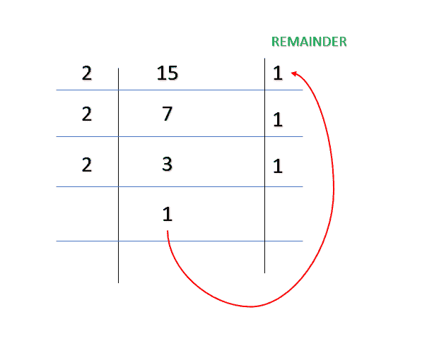

# Python 程序打印从 1 到 N 的数字的二进制值

> 原文:[https://www . geesforgeks . org/python-program-to-print-numbers-从 1 到 n 的二进制值/](https://www.geeksforgeeks.org/python-program-to-print-the-binary-value-of-the-numbers-from-1-to-n/)

给定一个正数 N，这里的任务是打印从 1 到 N 的数字的二进制值。为此，可以使用各种方法。

数字的二进制表示是仅使用 1 和 0 的等值。例如 k = 15，二进制值是 1 1 1 1



为方法 1 工作

### **方法 1:** 利用初等方法进行递归。

**接近**

*   用 2 除 k。
*   函数的递归调用，并在从递归调用返回时打印余数。
*   重复以上步骤，直到 k 大于 1。
*   重复以上步骤，直到我们到达 N

**程序:**

## 蟒蛇 3

```
# code to print binary values of first 5 numbers

# recursive function
def Print_Binary_Values(num):
    # base condition
    if(num > 1):
        Print_Binary_Values(num // 2)
    print(num % 2, end="")

# driver code
if __name__ == "__main__":
    N = 5

    # looping N times
    for i in range(1, N+1):
        Print_Binary_Values(i)
        print(end=" ")
```

**输出**

> 1 10 11 100 101

### **方法 2:** 使用按位运算符。

**接近**

*   检查 k 是否大于 1
*   将数字右移 1 位，并对函数执行递归调用
*   打印数字的位数
*   重复这些步骤，直到我们到达北

**程序:**

## 蟒蛇 3

```
# code to print binary values of first 5 numbers

# recursive function

def Print_Binary_Values(num):

    # base condition
    if(num > 1):
        Print_Binary_Values(num >> 1)
    print(num & 1, end="")

# driver code
if __name__ == "__main__":
    N = 5

    # looping N times
    for i in range(1, N+1):
        Print_Binary_Values(i)
        print(end=" ")
```

**输出**

> 1 10 11 100 101

### **方法 3:** 使用内置的 Python 库

bin()是一个内置的 python 函数，可以将作为输入给它的任何十进制数转换为其等效的二进制数。

**语法:**

> 箱(编号)

这里的数字是转换成二进制的十进制数

**程序**

## 蟒蛇 3

```
# code to print first 5 binary number using builtIn library

def Print_Binary_Number(num):
    for i in range(1, num+1):

        # using bin to print binary value
        print(int(bin(i).split('0b')[1]), end=" ")

# driver code
if __name__ == "__main__":
    num = 5
    Print_Binary_Number(num)
```

**输出**

> 1 10 11 100 101