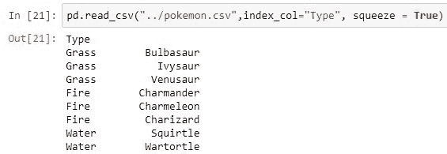
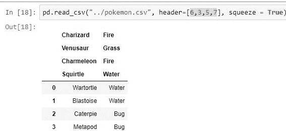

# Python 程序读取 CSV 无需 CSV 模块

> 原文:[https://www . geesforgeks . org/python-program-to-read-CSV-不带-csv-module/](https://www.geeksforgeeks.org/python-program-to-read-csv-without-csv-module/)

[CSV(逗号分隔值)](https://www.geeksforgeeks.org/working-csv-files-python/)是一种简单的文件格式，用于存储表格数据，如电子表格或数据库。CSV 文件以纯文本形式存储表格数据(数字和文本)。文件的每一行都是数据记录。每条记录由一个或多个字段组成，用逗号分隔。使用逗号作为字段分隔符是这种文件格式的名称来源。

CSV 文件可以使用名为`[Pandas](https://www.geeksforgeeks.org/python-programming-language/#Pandas)`的 Python 库读取。这个库可以用来读取几种类型的文件，包括 CSV 文件。我们使用库函数 read_csv(输入)来读取 csv 文件。您想要读取的 CSV 文件的 URL/路径作为函数的输入。

**语法:**

> **PD . read _ CSV(**file path _ or _ buffer，sep= '，'，分隔符=无，标头= '推断'，名称=无，index _ col =无，usecols =无，挤压=假，前缀=无，mangle _ dupe _ cols =真，dtype =无，引擎=无，转换器=无，true _ values =无，false _ values =无，skipinitialspace =假，skiprows =无，nrows =无，na _ values =无，keep _ default _ na =真，lineterminator=None，quotechar= ' " '，引号=0，转义符=None，注释=None，编码=None，方言=None，tupleize_cols=None，error_bad_lines=True，warn_bad_lines=True，skipfooter=0，doublequote=True，delim _ 空白=False，low_memory=True，memory_map=False，float_precision=None **)**

不是所有的都很重要，但是记住这些实际上可以节省自己执行相同功能的时间。在 jupyter 笔记本上按 shift + tab 可以看到任何功能的参数。下面给出了有用的例子及其用法:

| 参数 | 使用 |
| --- | --- |
| 文件路径或缓冲区 | 文件的网址或目录位置 |
| 九月 | 代表分隔符，默认值为'，'，如 csv 格式(逗号分隔值) |
| 索引 _ 列 | 将传递的列作为索引，而不是 0、1、2、3…r
 |
| 页眉 | Makes passed row/s[int/int list] as header |
| 使用 _cols | 仅使用传递的列[字符串列表]来制作数据框 |
| 挤压 | 如果为真，并且只传递了一列，则返回 pandas 系列 |
| skip prows | 跳过新数据框中的传递行 |

如果给定路径无效，即文件不在给定路径上，则函数给出`FileNotFoundError`。但是如果函数成功读取文件，那么它会返回一个类型为`class pandas.core.frame.DataFrame`的对象。然后，通过使用函数`dataframe.to_numpy()`可以将返回的数据帧(对象)转换为 numpy 数组。该函数附带熊猫，并返回数据帧的 numpy 数组表示。然后，我们可以使用`arr`作为 numpy 数组来执行所需的操作。

**示例:**

```
# PYthon program to read 
# CSV file without csv module

import pandas as pd

#reading a csv file with pandas
data_frame = pd.read_csv("pokemon.csv")   

#give the datatype of a pandas 
# object
print(type(data_frame))  

#this function gives us a 
# brief view of the data.
print(data_frame.head)

#converting pandas dataframe
# to a numpy array.
arr = data_frame.to_numpy()
print(arr)
```

**输出:**

