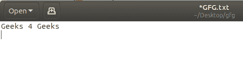
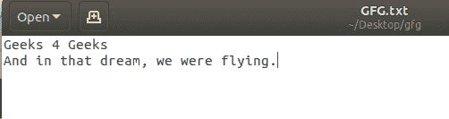

# Python 程序逐字读取文件

> 原文:[https://www . geesforgeks . org/python-程序到文件逐字读取/](https://www.geeksforgeeks.org/python-program-to-read-file-word-by-word/)

**先决条件:**[Python 中的文件处理](https://www.geeksforgeeks.org/file-handling-python/)

给定一个文本文件，任务是在 Python 中逐字读取文件中的信息。

**示例:**

> **输入:**
> 我是 R2J！
> **输出:**
> 我
> 是
> R2J！
> 
> **输入:**
> 极客 4 极客
> 在那个梦里，我们在飞。
> **输出:**
> 极客
> 4
> 极客
> 和
> 在
> 那个
> 梦里，
> 我们
> 被
> 撞飞了。

**进场:**

1.  在*中打开一个文件，读取包含字符串的*模式。
2.  使用`for`循环从文本文件中读取每一行。
3.  再次使用`for`循环从由“”分割的行中读取每个单词。
4.  显示文本文件中每行的每个单词。

**示例 1:** 假设文本文件如下所示–

**文本文件:**



```py
# Python program to read 
# file word by word

# opening the text file
with open('GFG.txt','r') as file:

    # reading each line    
    for line in file:

        # reading each word        
        for word in line.split():

            # displaying the words           
            print(word) 
```

**输出:**

```py
Geeks
4
geeks
```

**示例 2:** 假设文本文件包含多行。

**文本文件:**



```py
# Python program to read 
# file word by word

# opening the text file
with open('GFG.txt','r') as file:

    # reading each line    
    for line in file:

        # reading each word        
        for word in line.split():

            # displaying the words           
            print(word) 
```

**输出:**

```py
Geeks
4
Geeks
And
in
that
dream,
we
were
flying.

```