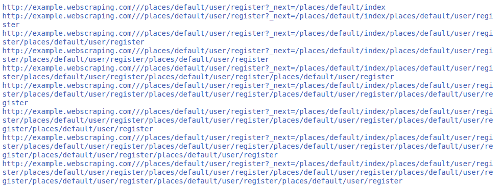

# Python 程序递归刮除网站所有网址

> 原文:[https://www . geeksforgeeks . org/python-program-to-recursive-刮掉网站的所有 URL/](https://www.geeksforgeeks.org/python-program-to-recursively-scrape-all-the-urls-of-the-website/)

在本教程中，我们将看到如何递归地从网站上抓取所有的网址

计算机科学中的递归是一种解决问题的方法，其中解决方案依赖于同一问题的较小实例的解决方案。这样的问题通常可以通过迭代来解决，但是这需要在编程时识别和索引较小的实例。

**注:**详见[递归](https://www.geeksforgeeks.org/recursion/)

#### 所需模块和安装

*   **请求:**
    请求让你可以极其轻松地发送 HTTP/1.1 请求。没有必要手动添加查询字符串到你的网址。

    ```
    pip install requests
    ```

*   **美人汤:**
    美人汤是一个很容易从网页上抓取信息的库。它位于 HTML 或 XML 解析器之上，为迭代、搜索和修改解析树提供了 Pythonic 习惯用法。

    ```
    pip install beautifulsoup4
    ```

**代码:**

```
from bs4 import BeautifulSoup
import requests

# lists
urls=[]

# function created
def scrape(site):

    # getting the request from url
    r = requests.get(site)

    # converting the text
    s = BeautifulSoup(r.text,"html.parser")

    for i in s.find_all("a"):

        href = i.attrs['href']

        if href.startswith("/"):
            site = site+href

            if site not in  urls:
                urls.append(site) 
                print(site)
                # calling it self
                scrape(site)

# main function
if __name__ =="__main__":

    # website to be scrape
    site="http://example.webscraping.com//"

    # calling function
    scrape(site)

```

**输出:**

