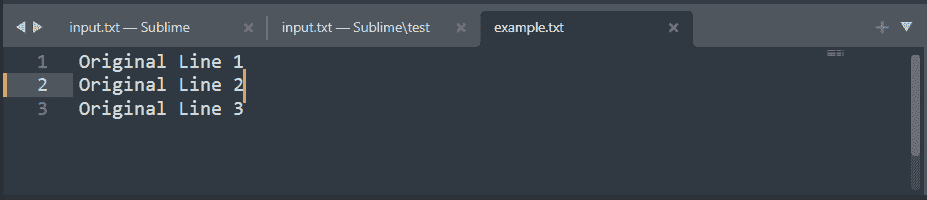
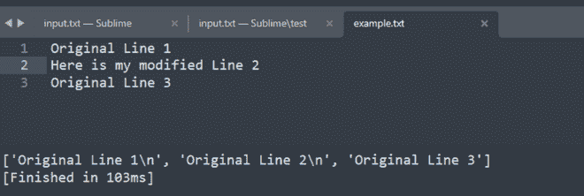

# Python 程序替换文件中的特定行

> 原文:[https://www . geesforgeks . org/python-程序替换特定文件行/](https://www.geeksforgeeks.org/python-program-to-replace-specific-line-in-file/)

在本文中，我们将编写一个 Python 程序来替换文件中的特定行。

我们将首先以只读模式打开文件，并使用**readline()**读取所有行，创建一个行列表，将其存储在一个变量中。我们将对特定行进行必要的更改，之后，我们以只写模式打开文件，并使用**writeline()**写入修改后的数据。

演示文件:



### 解释:

首先，以只读模式打开文件，使用**readline()**方法逐行读取文件，并将其存储在变量中。

```py
with open('example.txt','r',encoding='utf-8') as file:
    data = file.readlines()
```

变量将包含一个行列表，打印它将显示列表中的所有行。

```py
print(data)
```

对特定行进行必要的更改。*(这里我修改了第二行)*

```py
data[1] = "Here is my modified Line 2\n"
```

在只写模式下再次打开文件，使用 **writelines()** 方法写入修改后的数据。

```py
With open('example.txt', 'w', encoding='utf-8') as file:
    file.writelines(data)
```

#### **下面是实现:**

## 蟒蛇 3

```py
with open('example.txt', 'r', encoding='utf-8') as file:
    data = file.readlines()

print(data)
data[1] = "Here is my modified Line 2\n"

with open('example.txt', 'w', encoding='utf-8') as file:
    file.writelines(data)
```

**输出:**

```py
['Line 1\n', 'Here is my modified Line 2\n', 'Line 3']
```

**修改后:**

