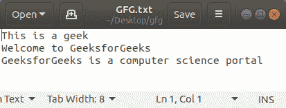
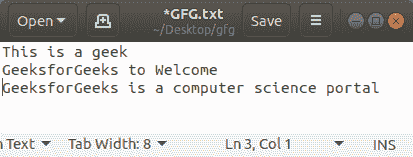

# Python 程序反转一个文本文件的一行

> 原文:[https://www . geesforgeks . org/python-program-to-reverse-单行文本文件/](https://www.geeksforgeeks.org/python-program-to-reverse-a-single-line-of-a-text-file/)

给定一个文本文件。任务是从给定的文本文件中反转用户选择的一行，并更新已经存在的文件。

**示例:**

```py
Input:
        Hello Geeks
        for geeks!

  User choice = 1

Output:
        Hello Geeks
        geeks! for

Input:
        This is a geek
        Welcome to GeeksforGeeks
        GeeksforGeeks is a computer science portal

    User choice = 0

Output:
        geek a is This
        Welcome to GeeksforGeeks
        GeeksforGeeks is a computer science portal

```

**实施:**

让我们假设文本文件如下所示–



```py
# Open file in read mode
f = open('GFG.txt', 'r')

# Read the content of the
# file and store it in a list
lines = f.readlines()

# Close file
f.close()

# User's choice
choice = 1

# Split the line into words 
line = lines[choice].split()

# line is reversed
Reversed = " ".join(line[::-1])

# Updating the content of the
# file
lines.pop(choice)
lines.insert(choice, Reversed)

# Open file in write mode
u = open('GFG.txt', 'w')

# Write the new content in file
# and note, it is overwritten 
u.writelines(lines)
u.close()
```

**输出:**

