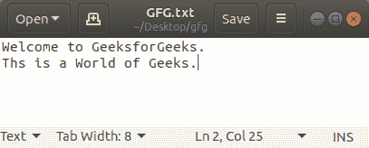
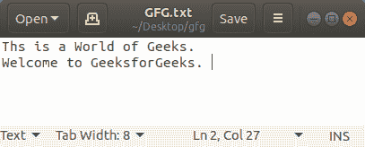

# 使用堆栈反转文件内容的 Python 程序

> 原文:[https://www . geesforgeks . org/python-program-to-reverse-of-a-file-content-use-stack/](https://www.geeksforgeeks.org/python-program-to-reverse-the-content-of-a-file-using-stack/)

给定一个文件，任务是使用 Stack 以相反的顺序打印和存储该文件的行。

**示例:**

```py
Input :
I am
new to this
world of
Python.

Output :
Python.
world of
new to this
I am

Input :
1
2
3
4
5
Output :
5
4
3
2
1

```

**进场:**

*   创建一个空堆栈。
*   逐一将文件的每一行推入堆栈。
*   一个接一个地从堆栈中弹出每一行，并将它们放回文件中。

下面是实现。

**输入文件:**



```py
# Python3 code to reverse the lines
# of a file using Stack.

# Creating Stack class (LIFO rule)
class Stack:

    def __init__(self):

        # Creating an empty stack
        self._arr = []

    # Creating push() method.
    def push(self, val):
        self._arr.append(val)

    def is_empty(self):

        # Returns True if empty
        return len(self._arr) == 0

    # Creating Pop method.
    def pop(self):

        if self.is_empty():
            print("Stack is empty")
            return

        return self._arr.pop()

# Creating a function which will reverse
# the lines of a file and Overwrites the 
# given file with its contents line-by-line
# reversed
def reverse_file(filename):

    S = Stack()
    original = open(filename)

    for line in original:
        S.push(line.rstrip("\n"))

    original.close()

    output = open(filename, 'w')

    while not S.is_empty():
        output.write(S.pop()+"\n")

    output.close()

# Driver Code
filename = "GFG.txt"

# Calling the reverse_file function
reverse_file(filename)

# Now reading the content of the file
with open(filename) as file:
        for f in file.readlines():
            print(f, end ="")
```

**输出:**

```py
Ths is a World of Geeks.
Welcome to GeeksforGeeks.
```

