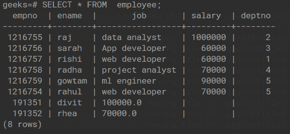
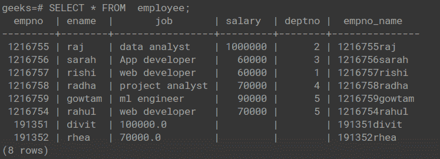

# Python Psycopg2–将列连接到新列

> 原文:[https://www . geesforgeks . org/python-psycopg2-concatenate-columns-to-new-column/](https://www.geeksforgeeks.org/python-psycopg2-concatenate-columns-to-new-column/)

在本文中，我们将看到如何将 PostgreSQL 数据库中一个表的多列连接成一列。为了将两列或多列连接成一列，PostgreSQL 为我们提供了 [concat()](https://www.geeksforgeeks.org/concat-function-in-mysql/) 函数。

### 演示表:



在下面的代码中，首先，通过使用 connect()方法建立到 PostgreSQL 数据库“极客”的连接。连接到数据库后，使用 execute()命令执行 SQL update 命令，这有助于我们创建一个名为“empno_name”的新列，在创建该列后，我们使用 update 命令在连接上表中的“empno”和“ename”列后用连接的值填充新列。第三个 SQL 命令“从 empno _ name 中选择员工”用于查看串联的列。

### **下面是实现:**

## 蟒蛇 3

```
import psycopg2

conn = psycopg2.connect(
    database="geeks", user='postgres',
    password='root', host='localhost', port='5432'
)

conn.autocommit = True
cursor = conn.cursor()

# adding an extra column
sql ='''alter table employee add column empno_name varchar(30);'''
cursor.execute(sql)

# updating the new tables  with values
sql1 = '''UPDATE employee SET  empno_name = concat(empno, ename);'''

cursor.execute(sql1)

# printing out the concatenated column
sql2 = '''select empno_name from employee;'''
cursor.execute(sql2)
results = cursor.fetchall()
for i in results:
    print(i)
conn.commit()
conn.close()
```

**输出:**

```
('1216755raj',)
('1216756sarah',)
('1216757rishi',)
('1216758radha',)
('1216759gowtam',)
('1216754rahul',)
('191351divit',)
('191352rhea',)
```

### PostgreSQL 输出:

