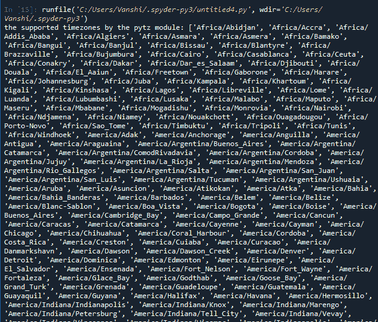
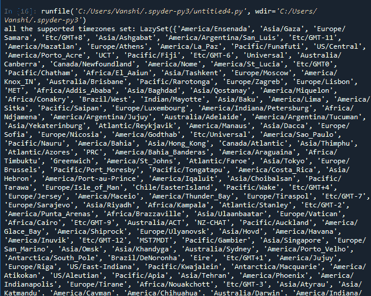
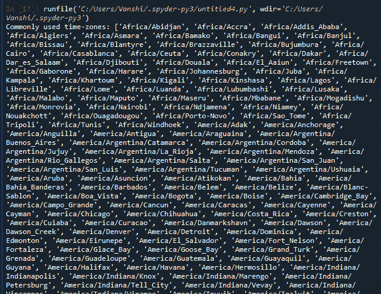

# Python pytz

> 哎哎哎:# t0]https://www . geeksforgeeks . org/python-pytz/

Pytz 将 Olson tz 数据库引入 Python，因此支持几乎所有时区。该模块提供日期时间转换功能，并帮助用户服务于国际客户群。它支持 Python 应用程序中的时区计算，还允许我们创建时区感知日期时间实例。

### 装置

Python pytz 模块可以按照给定的方式安装。

*   使用命令行:

```py
pip install pytz
```

*   使用 tarball，以管理用户身份运行以下命令:

```py
python setup.py install
```

*   使用 setuptools，将从 Python 包索引中为您下载最新版本:

```py
easy_install --upgrade pytz
```

### 转换时区

通过使用 astimezone()函数，我们可以将时间转换为不同的时区。

> **语法:**像散区(t)
> 
> **参数:** t 为需要转换的时间
> 
> **返回:**转换时区

**示例:**

## 蟒蛇 3

```py
from datetime import datetime
from pytz import timezone

format = "%Y-%m-%d %H:%M:%S %Z%z"

# Current time in UTC
now_utc = datetime.now(timezone('UTC'))
print(now_utc.strftime(format))

# Convert to Asia/Kolkata time zone
now_asia = now_utc.astimezone(timezone('Asia/Kolkata'))
print(now_asia.strftime(format))
```

**输出**

> 2020-12-30 04:38:16 UTC+0000
> 
> 2020-12-30 10:08:16 IST+0530

## Python pytz 属性

pytz 模块中有一些属性可以帮助我们找到支持的时区字符串。这些属性将有助于更好地理解本模块。

*   **all_timezones**

它用 pytz.all_timezones 返回所有可用时区的列表:

## 蟒蛇 3

```py
import pytz

print('the supported timezones by the pytz module:',
      pytz.all_timezones, '\n')
```

**输出:**



上面的输出显示了一些值，因为列表非常大。

*   **所有时区设置**

它返回 pytz.all_timezones_set 中所有可用时区的集合:

## 蟒蛇 3

```py
import pytz

print('all the supported timezones set:',
      pytz.all_timezones_set, '\n')
```

**输出**



输出顺序在您的系统中会有所不同，因为它是一个集合。

*   **公共时区，公共时区设置**

它返回 pytz.common_timezones，pytz.common_timezones_set 常用时区的列表和集合。

## 蟒蛇 3

```py
import pytz

print('Commonly used time-zones:', 
      pytz.common_timezones, '\n')

print('Commonly used time-zones-set:',
      pytz.common_timezones_set, '\n')
```

**输出**



*   **国家名称**

它返回一组国家 ISO Alpha-2 代码和国家名称作为键值对。

## 蟒蛇 3

```py
import pytz

print('country_names =')

for key, val in pytz.country_names.items():
    print(key, '=', val, end=',')

print('\n')
print('equivalent country name to the input code: =',
      pytz.country_names['IN'])
```

**输出**

> 国名=AD =安道尔，AE =阿拉伯联合酋长国，TD =乍得，…。，ZA =南非，ZM =赞比亚，ZW =津巴布韦，
> 相当于输入代码的国家名称:印度

*   **国家 _ 时区**

它返回一个国家的字典 ISO Alpha-2 代码作为关键字，并返回一个特定输入关键字(国家代码)的支持时区列表作为值

## 蟒蛇 3

```py
import pytz

print('country_timezones =')

for key, val in pytz.country_timezones.items():
    print(key, '=', val, end=',')

print('\n')
print('Time-zones supported by Antartica =', pytz.country_timezones['AQ'])
```

**输出**

> country_timezones =
> AD = ['欧洲/安道尔']，AE = ['亚洲/迪拜']，AF = ['亚洲/喀布尔']，…..，ZM = ['非洲/卢萨卡']，ZW = ['非洲/哈拉雷']，
> 南极支持的时区= ['南极洲/麦克默多'，'南极洲/凯西'，'南极洲/戴维斯'，'南极洲/杜蒙杜维尔'，'南极洲/莫森'，'南极洲/帕尔默'，'南极洲/罗塞拉'，'南极洲/西沃'，'南极洲/巨魔'，'南极洲/沃斯托克']

### Python pytz 示例

下面给出了一些例子来说明如何使用这个模块。

**示例 1:** 使用时区信息创建日期时间实例。

## 蟒蛇 3

```py
# import the modules
import pytz
import datetime
from datetime import datetime

# getting utc timezone
utc = pytz.utc

# getting timezone by name
kiev_tz = pytz.timezone('Europe/Kiev')
print('UTC Time =', datetime.now(tz=utc))
print('IST Time =', datetime.now(tz=kiev_tz))
```

**输出**

> 世界协调时时间= 2020-12-15 08:23:17.063960+00:00
> 
> 时间= 2020-12-15 10:23:17.063988+02:00

**例 2:**

## 蟒蛇 3

```py
# import the modules
import pytz
import datetime

d = datetime.datetime(1984, 1, 10, 23, 30)

# strftime method allows you to print a string 
# formatted using a series of formatting directives
d1 = d.strftime("%B %d, %Y")

# isoformat method used for quickly generating 
# an ISO 8601 formatted date/time
d2 = d.isoformat()
print(d1)
print(d2)
```

**输出**

> 1984 年 1 月 10 日
> 
> 1984-01-10T23:30:00

### 本地化()

localize()是用于创建具有初始固定日期时间值的日期时间感知对象的正确函数。生成的日期时间感知对象将具有原始日期时间值。这个函数由 python 库提供。pytz.localize()对于让幼稚的时区感知很有用。当前端客户端向后端发送日期时间以被视为特定时区(通常为 UTC)时，这非常有用。

**示例:**

## 蟒蛇 3

```py
import pytz
import datetime
from datetime import datetime

# using localize() function, my system is on IST timezone
ist = pytz.timezone('Asia/Kolkata')
utc = pytz.utc
local_datetime = ist.localize(datetime.now())

print('IST Current Time =', local_datetime.strftime('%Y-%m-%d %H:%M:%S %Z%z'))
print('Wrong UTC Current Time =', utc.localize(
    datetime.now()).strftime('%Y-%m-%d %H:%M:%S %Z%z'))
```

**输出**

> 当前时间= 2020-12-15 08:49:56 is+0530
> 
> 世界协调时错误当前时间= 2020-12-15 08:49:56 世界协调时+0000

**例**

## 蟒蛇 3

```py
from datetime import datetime
from pytz import timezone

# Set the time to noon on 2019-08-19
naive = datetime(2019, 8, 19, 12, 0)

# Let's treat this time as being in the UTC timezone
aware = timezone('UTC').localize(naive)
print(aware)
```

**输出**

> 2019-08-19 12:00:00+00:00