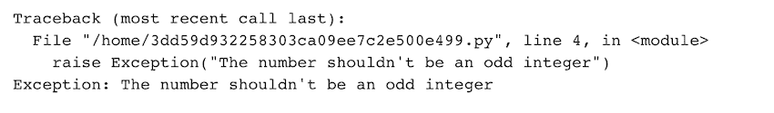
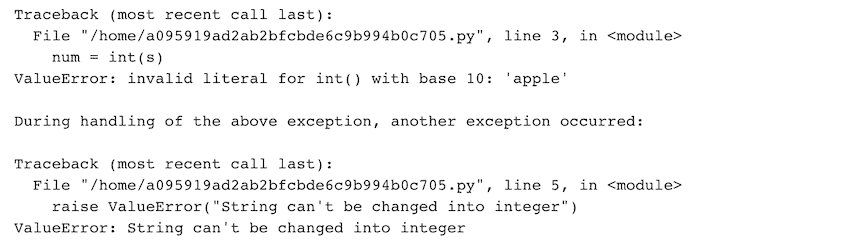
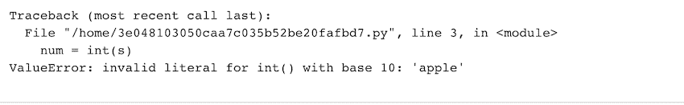

# Python 提升关键字

> 原文:[https://www.geeksforgeeks.org/python-raise-keyword/](https://www.geeksforgeeks.org/python-raise-keyword/)

**Python raise 关键字**用于引发异常或错误。raise 关键字引发错误并停止程序的控制流。它用于在异常处理程序中调出当前异常，以便可以在调用堆栈的更高层处理它。

**raise 关键字的语法:**

> 引发{name_of_ the_ exception_class}

引发错误的基本方法是:

> 引发异常(“用户文本”)

**示例:**

在下面的代码中，我们检查一个整数是偶数还是奇数。如果整数是奇数，则会引发异常。a 是一个变量，我们给它分配了一个数字 5，因为 a 是奇数，那么如果循环检查它是否是奇数，如果它是奇数，那么就会产生一个错误。

**输入:**

## 蟒蛇 3

```py
a = 5

if a % 2 != 0:
    raise Exception("The number shouldn't be an odd integer")
```

**输出:**



在产生错误的同时，我们也可以知道我们需要产生什么样的错误，并在必要时打印出一个文本。

**语法:**

> 提高类型错误

**示例:**

在下面的代码中，我们尝试将分配给 s 的字符串“apple”更改为 integer，并编写了一个 try-except 子句来引发 ValueError。raise 关键字引发值错误，并显示消息“字符串不能更改为整数”。

**输入:**

## 蟒蛇 3

```py
s = 'apple'

try:
    num = int(s)
except ValueError:
    raise ValueError("String can't be changed into integer")
```

**输出**:



## **在不指定异常类的情况下引发异常**

当我们使用 raise 关键字时，没有强制要求同时给出一个异常类。当我们没有用 raise 关键字给出任何异常类名时，它会重新显示上次发生的异常。

**示例:**

在上面的代码中，我们尝试将字符串“apple”更改为 integer，并编写了一个 try-except 子句来引发 ValueError。代码和以前一样，只是我们没有提供异常类，它重新调用了上次发生的异常。

**输入:**

## 蟒蛇 3

```py
s = 'apple'

try:
    num = int(s)
except:
    raise
```

**输出:**



## **加注关键字的优势:**

*   当我们可能遇到执行无法继续的情况时，它会帮助我们引发异常。
*   它帮助我们重新评估被捕获的异常。
*   Raise 允许我们在任何时候抛出一个异常。
*   当我们想要处理输入验证时，它很有用。