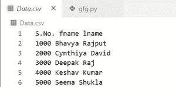
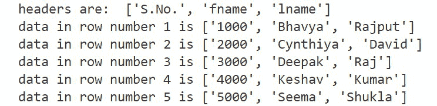

# Python–将 CSV 列读入没有标题的列表

> 原文:[https://www . geesforgeks . org/python-read-CSV-column-to-list-不带标题/](https://www.geeksforgeeks.org/python-read-csv-column-into-list-without-header/)

**先决条件:** [**在 CSV 中读写数据**](https://www.geeksforgeeks.org/reading-and-writing-csv-files-in-python/)

借助 [csv 库](https://www.geeksforgeeks.org/working-csv-files-python/)在 python 中解析 CSV 文件。csv 库包含用于从 CSV 文件读取数据、向 CSV 文件写入数据和处理数据的对象。有时，在处理大量数据时，我们希望省略几行或几列，以便利用最少的内存。让我们看看如何通过跳过标题来读取 CSV 文件。

### **将 CSV 列读入无标题的** **列表的步骤:**

1.  导入 **csv** 模块。
2.  通过在 csv.reader()函数中传递文件对象来创建读取器对象(迭代器)。
3.  在这个迭代器对象上调用 next()函数，返回 CSV 的第一行。
4.  将标题存储在单独的变量中。
5.  遍历 csv 文件的剩余行，并将它们存储在另一个列表中。
6.  打印此列表进行验证。

**示例:**

下面的代码读取数据. csv 文件。



**以下是完整实现:**

## 蟒蛇 3

```py
import csv

# reading data from a csv file 'Data.csv'
with open('Data.csv', newline='') as file:

    reader = csv.reader(file, delimiter = ' ')

    # store the headers in a separate variable,
    # move the reader object to point on the next row
    headings = next(reader)

    # output list to store all rows
    Output = []
    for row in reader:
        Output.append(row[:])

for row_num, rows in enumerate(Output):
    print('data in row number {} is {}'.format(row_num+1, rows))

print('headers were: ', headings)
```

**输出:**

