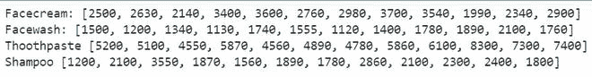
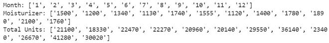

# Python–将 CSV 列读入列表

> 原文:[https://www . geesforgeks . org/python-read-CSV-columns-to-list/](https://www.geeksforgeeks.org/python-read-csv-columns-into-list/)

CSV 文件以纯文本形式存储表格数据(数字和文本)。文件的每一行都是数据记录。每条记录由一个或多个字段组成，用逗号分隔。使用逗号作为字段分隔符是这种文件格式的名称来源。在本文中，我们将把 CSV 文件中的数据读入一个列表。我们将使用熊猫的图书馆把数据读入一个列表。

**文件使用:**文件 T2。

**方法 1:** 利用熊猫

这里，我们有 read_csv()函数，它通过简单地创建 csv 文件的对象来帮助读取 CSV 文件。可以在这个对象中写入列名来访问特定的列，就像我们访问数组元素一样。Pandas library 有一个名为 tolist()的函数，它将数据转换成一个列表，可以按照我们的要求使用。因此，我们将使用它将列数据转换为列表。最后，我们将打印列表。

**进场:**

*   导入模块。
*   从 CSV 文件中读取数据。
*   将其转换为列表。
*   打印列表。

**下面是实现:**

## 蟒蛇 3

```
# importing module
from pandas import *

# reading CSV file
data = read_csv("company_sales_data.csv")

# converting column data to list
month = data['month_number'].tolist()
fc = data['facecream'].tolist()
fw = data['facewash'].tolist()
tp = data['toothpaste'].tolist()
sh = data['shampoo'].tolist()

# printing list data
print('Facecream:', fc)
print('Facewash:', fw)
print('Toothpaste:', tp)
print('Shampoo:', sh)
```

**输出:**



**方法 2:** 使用 csv 模块

在这个方法中，我们将导入 csv 库并以读取模式打开文件，然后我们将使用 DictReader()函数读取 CSV 文件的数据。这个函数就像一个普通的阅读器，但是它将信息映射到一个字典中，该字典的键由列名给出，所有的值都作为键给出。我们将创建空列表，以便在其中存储值。最后，我们访问键值，并将它们附加到空列表中，并打印该列表。

## 蟒蛇 3

```
# importing the module
import csv

# open the file in read mode
filename = open('company_sales_data.csv', 'r')

# creating dictreader object
file = csv.DictReader(filename)

# creating empty lists
month = []
totalprofit = []
totalunit = []

# iterating over each row and append
# values to empty list
for col in file:
    month.append(col['month_number'])
    totalprofit.append(col['moisturizer'])
    totalunit.append(col['total_units'])

# printing lists
print('Month:', month)
print('Moisturizer:', totalprofit)
print('Total Units:', totalunit)
```

**输出:**

