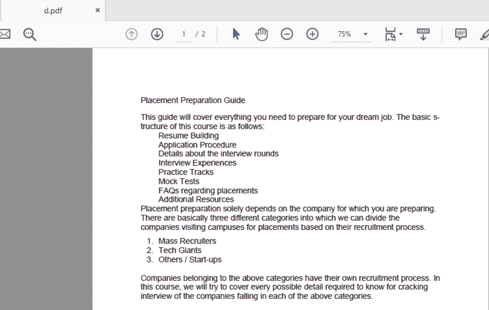
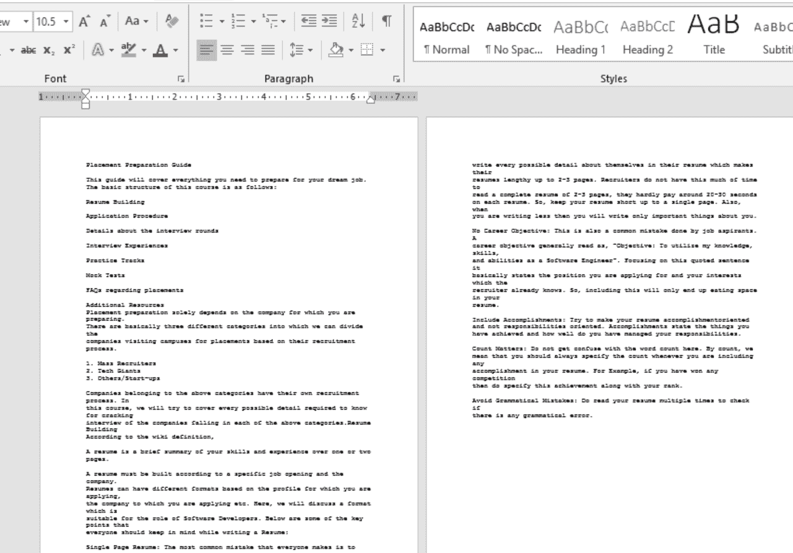

# Python |使用 OCR(光学字符识别)读取 PDF 内容

> 原文:[https://www . geesforgeks . org/python-reading-contents-of-pdf-using-ocr-optical-character-recognition/](https://www.geeksforgeeks.org/python-reading-contents-of-pdf-using-ocr-optical-character-recognition/)

Python 被广泛用于分析数据，但是数据不一定总是需要的格式。在这种情况下，我们转换该格式(如 PDF 或 JPG 等)。)转换为文本格式，以便以更好的方式分析数据。Python 提供了许多库来完成这项任务。

有几种方法可以做到这一点，包括使用像 Python 中的 [PyPDF2 这样的库](https://www.geeksforgeeks.org/working-with-pdf-files-in-python/)。使用这些库的主要缺点是编码方案。PDF 文档可以有多种编码，包括 UTF-8、ASCII、Unicode 等。因此，由于编码方案的原因，将 PDF 转换为文本可能会导致数据丢失。

让我们看看如何读取 PDF 文件的所有内容，并使用光学字符识别将其存储在文本文档中。

首先，我们需要将 PDF 的页面转换成图像，然后使用光学字符识别(OCR)从图像中读取内容并将其存储在文本文件中。

**所需安装:**

```py
pip3 install PIL
pip3 install pytesseract
pip3 install pdf2image
sudo apt-get install tesseract-ocr
```

这个计划有两个部分。

**第 1 部分**处理将 PDF 转换为图像文件。PDF 的每一页都存储为图像文件。存储的图像名称为:
PDF 第 1 页- > page_1.jpg
PDF 第 2 页- > page_2.jpg
PDF 第 3 页- > page_3.jpg
…。
PDF 第 n 页- >第 _n.jpg 页

**第 2 部分**处理从图像文件中识别文本并将其存储到文本文件中。这里，我们处理图像并将其转换为文本。一旦我们将文本作为字符串变量，我们就可以对文本进行任何处理。例如，在许多 pdf 中，当一行完成，但某个特定的单词不能完全写在同一行中时，会添加一个连字符(“-”)，该单词会在下一行继续。例如–

```py
This is some sample text but this parti-

cular word could not be written in the same line.
```

现在对于这样的单词，要做一个基本的预处理，将连字符和新行转换成一个完整的单词。所有预处理完成后，该文本存储在单独的文本文件中。

要获取代码中使用的输入 PDF 文件，点击[d.pdf](https://media.geeksforgeeks.org/wp-content/uploads/d.pdf)

下面是实现:

```py
# Import libraries
from PIL import Image
import pytesseract
import sys
from pdf2image import convert_from_path
import os

# Path of the pdf
PDF_file = "d.pdf"

'''
Part #1 : Converting PDF to images
'''

# Store all the pages of the PDF in a variable
pages = convert_from_path(PDF_file, 500)

# Counter to store images of each page of PDF to image
image_counter = 1

# Iterate through all the pages stored above
for page in pages:

    # Declaring filename for each page of PDF as JPG
    # For each page, filename will be:
    # PDF page 1 -> page_1.jpg
    # PDF page 2 -> page_2.jpg
    # PDF page 3 -> page_3.jpg
    # ....
    # PDF page n -> page_n.jpg
    filename = "page_"+str(image_counter)+".jpg"

    # Save the image of the page in system
    page.save(filename, 'JPEG')

    # Increment the counter to update filename
    image_counter = image_counter + 1

'''
Part #2 - Recognizing text from the images using OCR
'''
    3
# Variable to get count of total number of pages
filelimit = image_counter-1

# Creating a text file to write the output
outfile = "out_text.txt"

# Open the file in append mode so that 
# All contents of all images are added to the same file
f = open(outfile, "a")

# Iterate from 1 to total number of pages
for i in range(1, filelimit + 1):

    # Set filename to recognize text from
    # Again, these files will be:
    # page_1.jpg
    # page_2.jpg
    # ....
    # page_n.jpg
    filename = "page_"+str(i)+".jpg"

    # Recognize the text as string in image using pytesserct
    text = str(((pytesseract.image_to_string(Image.open(filename)))))

    # The recognized text is stored in variable text
    # Any string processing may be applied on text
    # Here, basic formatting has been done:
    # In many PDFs, at line ending, if a word can't
    # be written fully, a 'hyphen' is added.
    # The rest of the word is written in the next line
    # Eg: This is a sample text this word here GeeksF-
    # orGeeks is half on first line, remaining on next.
    # To remove this, we replace every '-\n' to ''.
    text = text.replace('-\n', '')    

    # Finally, write the processed text to the file.
    f.write(text)

# Close the file after writing all the text.
f.close()
```

**输出:**

输入 PDF 文件:


输出文本文件:

正如我们看到的，PDF 的页面被转换成了图像。然后图像被读取，内容被写入文本文件。

**该方法的优点包括:**

1.  避免基于文本的转换，因为编码方案会导致数据丢失。
2.  由于光学字符识别的使用，即使是 PDF 格式的手写内容也可以被识别。
3.  仅识别 PDF 的特定页面也是可能的。
4.  获取文本作为变量，以便可以完成任何数量的所需预处理。

**该方法的缺点包括:**

1.  磁盘存储用于在本地系统中存储映像。虽然这些图像尺寸很小。
2.  使用光学字符识别不能保证 100%的准确性。给定一个计算机打印的 PDF 文档会导致非常高的准确性。
3.  手写 pdf 仍可识别，但准确性取决于手写、页面颜色等各种因素。