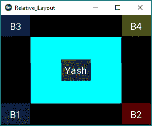
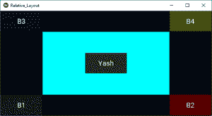

# Python | Kivy 中的相对布局使用。kv 文件

> 原文:[https://www . geesforgeks . org/python-relative-layout-in-kivy-using-kv-file/](https://www.geeksforgeeks.org/python-relative-layout-in-kivy-using-kv-file/)

Kivy 是 Python 中独立于平台的 GUI 工具。因为它可以在安卓、IOS、linux 和 Windows 等平台上运行。它基本上是用来开发安卓应用程序的，但并不意味着它不能在桌面应用程序上使用。

> 👉🏽 [Kivy 教程–通过示例学习 Kivy](https://www.geeksforgeeks.org/kivy-tutorial/)。

**相对布局:**

*   此布局的操作方式与浮动布局相同，但定位属性(x，y，center_x，right，y，center_y 和 top)是相对于布局大小而不是窗口大小的。
*   实际上，无论绝对和相对位置如何，当布局位置改变时，小部件都会移动。
*   可用的 pos_hint 键(x、center_x、right、y、center_y 和 top)对于对齐边缘或居中非常有用。
    **例如:**
    pos_hint: {'center_x':.5，' center_y':.5}会在中间对齐一个 Widget，不管窗口大小是多少。

我们使用 RelativeLayout 需要做的第一件事就是导入它。

```
from kivy.uix.relativelayout import RelativeLayout
```

> **我们可以通过:**
> **pos_hint:** 提供位置提示来做相对定位。
> 
> 我们最多可以定义 8 个键，也就是说，它采用字典形式的参数。
> pos _ hint = {“x”:1、“y”:1、“左”:1、“右”:1、“center _ x”:1、“center _ y”:1、“top”:1、“bottom”:1(“top”:0)}

**注意:**
Floatlayout 和 RelativeLayout 都支持绝对和相对定位，具体取决于使用的是 pos_hint 还是 pos。但是如果你想要绝对定位，使用浮动布局。

```
Basic Approach to create Relative Layout:
1) import kivy
2) import kivy App
3) import Relativelayout
4) Set minimum version(optional)
5) create class for layout 
6) create App class:
        - define build() function
7) Set up.kv file(name same ass the App class)
8) return Layout Class
9) Run an instance of the class
```

**下面是执行:**

**主. py 文件**

```
## Sample Python application demonstrating the 
## working of RelativeLayout in Kivy using .kv file 

################################################### 
# import modules 

import kivy 

# base Class of your App inherits from the App class. 
# app:always refers to the instance of your application 
from kivy.app import App 

# This layout allows you to set relative coordinates for children.
from kivy.uix.relativelayout import RelativeLayout

# To change the kivy default settings 
# we use this module config 
from kivy.config import Config 

# 0 being off 1 being on as in true / false 
# you can use 0 or 1 && True or False 
Config.set('graphics', 'resizable', True) 

# creating the root widget used in .kv file 
class RelativeLayout(RelativeLayout): 
    pass

# creating the App class in which name 
#.kv file is to be named Relative_Layout.kv 
class Relative_LayoutApp(App): 
    # defining build() 
    def build(self): 
        # returning the instance of root class 
        return RelativeLayout() 

# run the app 
if __name__ == "__main__": 
    Relative_LayoutApp().run() 
```

**[。kv 文件](https://www.geeksforgeeks.org/python-kivy-kv-file/)执行:**

```
#.kv file implementation of RelativeLayout 

# creating button feature 
<Button>:
        # size of text on button
        font_size: 20

        # creating button 
        # a button 20 % of the width and 20 % 
        # of the height of the layout 
        size_hint: 0.2, 0.2

<RelativeLayout>:

        # The Canvas is the root object
        # used for drawing by a Widget. 

        canvas:
                Color:
                        rgb:0, 1, 1
                Rectangle:
                        # creating rectangle
                        # pos = 20 % and size = 60 % of the layout
                        pos:[0.2 * coord for coord in self.size]
                        size:[0.6 * coord for coord in self.size]

        # creating the button

        Button:

                text:"B1"

                background_color: 0.1, 0.5, 0.6, 1

                # positioned at 0 % in x axis and 0 % in y axis 
                # from bottom left, i.e x, y = 0, 0 from bottom left: 
                pos_hint: {"x":0, "y":0} 

        Button: 
                text:"B2"
                background_color: 1, 0, 0, 1
                pos_hint: {"right":1, "y":0} 

        Button: 
                text:"Yash"
                background_color: 0.4, 0.5, 0.6, 1
                pos_hint: {"center_x":.5, "center_y":.5} 

        Button: 
                text:"B3"
                background_color: 0, 0, 1, 1
                pos_hint: {"x":0, "top":1} 

        Button: 
                text:"B4"
                background_color: 0.8, 0.9, 0.2, 1
                pos_hint: {"right":1, "top":1} 
```

**输出:**

有不同大小的窗口图像，显示它如何根据窗口调整自己，即相对

**影像 1:**


**图像 2:**


**图像 3:**


参考资料:【https://kivy . org/doc/stability/API-kivy . uix . relative layout . html】