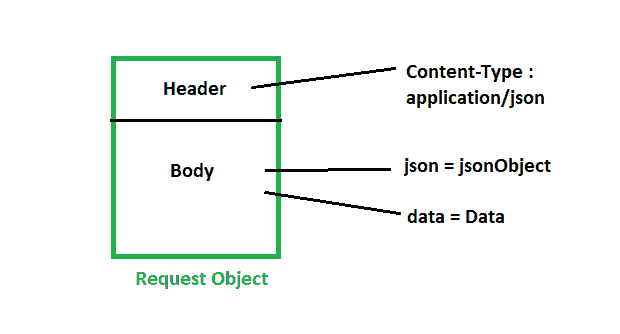
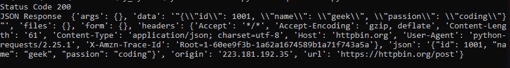
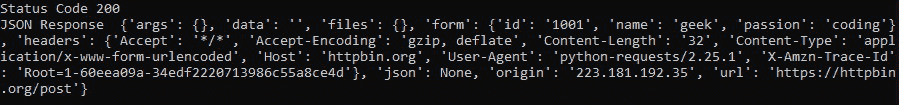

# Python 请求–带有标题和正文的 POST 请求

> 原文:[https://www . geeksforgeeks . org/python-requests-带有标题和正文的请求后/](https://www.geeksforgeeks.org/python-requests-post-request-with-headers-and-body/)

[**HTTP 头**](https://www.geeksforgeeks.org/http-headers/) 让客户端和服务器通过 HTTP 请求或响应传递附加信息。所有标题都不区分大小写，标题字段用冒号分隔，键值对采用明文字符串格式。

## 带有标题的请求

根据指定的头，请求根本不会改变其行为。头只是被传递到最终的请求中。所有标头值必须是字符串、字节字符串或 Unicode。虽然允许，但建议避免传递 Unicode 头值。我们可以用我们指定的头来发出请求，通过使用 headers 属性，我们可以告诉服务器关于请求的附加信息。

标题可以是 [Python 字典](https://www.geeksforgeeks.org/python-dictionary/)，比如{“标题的名称”:“标题的值”}

[认证头](https://www.geeksforgeeks.org/authentication-using-python-requests/)告诉服务器你是谁。通常，我们可以通过授权头发送身份验证凭据，以发出经过身份验证的请求。

**示例:**

> 标头= {“授权”:“我们的 _ 唯一 _ 秘密 _ 令牌”}
> 
> response = request . post(" https://example . com/get-my-account-detail "，headers=Headers)



请求对象结构

## **带体请求**

**开机自检请求**通过消息体传递数据，有效载荷将被设置为*数据*参数。数据参数采用字典、元组列表、字节或类似文件的对象。您需要将请求正文中发送的数据修改为指定的网址。

**语法:**

> requests.post(url，数据={key: value}，json={key: value}，headers={key:value}，args) *(data，json，headers 参数是可选的。)

下面给出的几个实现有助于更好地理解这个概念。

**示例 1:** 以数据作为有效载荷发送请求

## 蟒蛇 3

```
import requests

url = "https://httpbin.org/post"

data = {
    "id": 1001,
    "name": "geek",
    "passion": "coding",
}

response = requests.post(url, json=data)

print("Status Code", response.status_code)
print("JSON Response ", response.json())
```

**输出:**



**示例 2:** 发送带有 JSON 数据和头的请求

## 计算机编程语言

```
import requests
import json

url = "https://httpbin.org/post"

headers = {"Content-Type": "application/json; charset=utf-8"}

data = {
    "id": 1001,
    "name": "geek",
    "passion": "coding",
}

response = requests.post(url, headers=headers, json=data)

print("Status Code", response.status_code)
print("JSON Response ", response.json())
```

**输出:**

