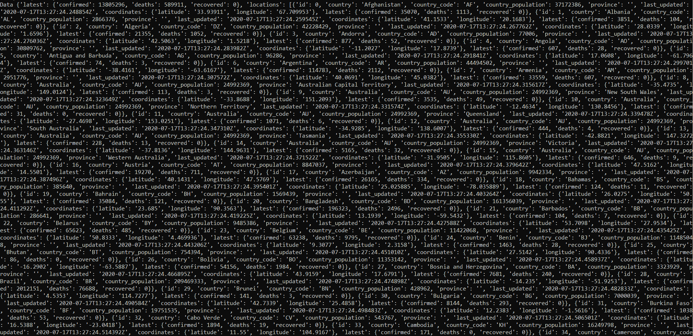
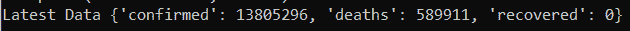

# Python–使用 COVID19Py 库

检索最新的新冠肺炎世界数据

> 原文:[https://www . geeksforgeeks . org/python-retrieve-latest-新冠肺炎-world-data-use-co vid 19 py-library/](https://www.geeksforgeeks.org/python-retrieve-latest-covid-19-world-data-using-covid19py-library/)

**COVID19Py** 库检索围绕新冠肺炎疫情的最新数据。这个新冠肺炎世界数据集托管在约翰·霍普斯金大学的服务器上。

要安装库，请在系统命令行中执行以下命令:

```
pip install COVID19Py 

```

该库提供以下方法:

*   **getAll():** 将整个数据集作为一个 JSON 进行检索
*   **getLatest():** 获取确诊病例、康复和死亡的最新统计数据
*   **获取地点():**获取新冠肺炎病例存在的地点
*   **getLatestChanges():** 查找自上次检索数据以来的任何更改

下面的例子说明了上述方法:

**示例:**

## 蟒蛇 3

```
# import given package
import COVID19Py

# Create an object,
# specify data source as JHU Servers
covid = COVID19Py.COVID19(data_source = "jhu")

# Retrieve all Data
# in the form of json
data = covid.getAll()

# Enormous Data will be returned
print("Data", data) 

# Get the latest data
latest = covid.getLatest()
print("Latest Data", latest)

# Get Locations where covid cases exist
# Can be Ranked by 'confirmed' cases,
# number of 'deaths' or
# number of 'recovered' patients
locations = covid.getLocations(timelines = True,
                               rank_by = 'confirmed')
print("Locations", locations) 

# Check for any changes since
# data was last retrieved
changes = covid.getLatestChanges()

# Printing changes, if any
print("Changes since last visit", changes)
```

**输出:**

**数据:**以 json 形式返回的海量数据；这个截图只显示了数据的前几行。



嵌套词典形式的国别 Covid 数据

**最新数据:**与 Covid19 相关的最新数字(全球)



全球 Covid19 数字

**位置数据:**大量位置相关的 Covid 数据将以 json 形式返回。这个截图代表了前几行。


位置数据

**自上次访问以来的变化:**当前全部为 0。


自上次访问以来的变化