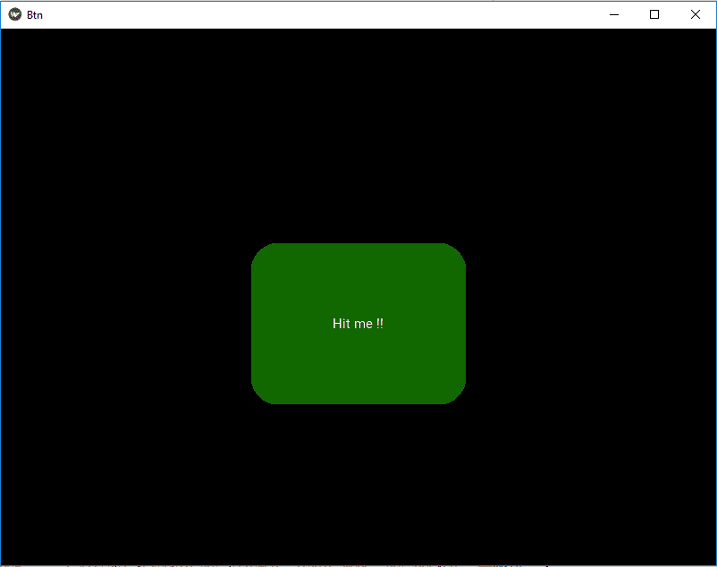

# Python–使用 kivy 舍入按钮角。kv 文件

> 原文:[https://www . geesforgeks . org/python-rounding-button-corners-in-kivy-using-kv-file/](https://www.geeksforgeeks.org/python-rounding-button-corners-in-kivy-using-kv-file/)

Kivy 是 Python 中独立于平台的 GUI 工具。因为它可以在安卓、IOS、linux 和 Windows 等平台上运行。它基本上是用来开发安卓应用程序的，但并不意味着它不能在桌面应用程序上使用。
在本文中，我们将学习如何在 kivy 中使用圆角按钮。Python 中的 kv 文件。
小部件总是矩形的，但是我们可以改变小部件的背景，通过分别使用 background_normal 和 background_down 这样的按钮属性，为按钮的正常和向下状态放置一些图像。此外，要使按钮的角变圆，您还必须了解按钮的另一个属性，即边框属性。

> **background_down :**
> 1)按钮的背景图像，用于按钮按下时的默认图形表示。
> 2) background_down 是 StringProperty。
> **背景 _ 正常:**
> 1)按钮未按下时用于默认图形表示的按钮背景图像。
> 2) background_normal 也是 StringProperty
> **边框:**
> 1)用于 BorderImage 图形指令的边框。与 background_normal 和 background_down 一起使用。可用于自定义背景。
> 2)必须是四个值的列表:(下、右、上、左)。
> 3)边框为列表属性，默认为(16，16，16，16)

**上述所有属性的语法:**

## 蟒蛇 3

```
background_normal: 'normal.png'
background_down: 'down.png'
border: 30, 30, 30, 30
```

```
Basic Approach:

1) import kivy
2) import kivyApp
3) import button and floatlayout
4) set minimum version(optional)
5) Create the Layout class
6) Create App class
7) Create .kv file:
          1) Add Base class
          2) Add Button properties
          3) Add Image as button
          4) Round the corners of the button using border property
8) return instance of the layout class
9) Run an instance of the class
```

> [**Kivy 教程——用例子学习 Kivy。**T3】](https://www.geeksforgeeks.org/kivy-tutorial/)

下面是我在这里使用的两个图像，即:
**normal.png 和 down.png**


**下面是实现我的方法的代码:**
**main.py**

## 蟒蛇 3

```
## Sample Python application demonstrating that  
## how to create button corners round in kivy using .kv file

##################################################         
# import kivy module
import kivy

# this restrict the kivy version i.e
# below this kivy version you cannot
# use the app or software
kivy.require("1.9.1")

# base Class of your App inherits from the App class.
# app:always refers to the instance of your application
from kivy.app import App

# module consist the floatlayout
# to work with FloatLayout first
# you have to import it
from kivy.uix.floatlayout import FloatLayout

# creates the button in kivy
# if not imported shows the error
from kivy.uix.button import Button

# this restrict the kivy version i.e  
# below this kivy version you cannot  
# use the app or software  
kivy.require('1.9.0') 

# to change the kivy default settings we use this module config
from kivy.config import Config

# 0 being off 1 being on as in true / false
# you can use 0 or 1 && True or False
Config.set('graphics', 'resizable', True)

# creating the root widget used in .kv file
class Base(FloatLayout):
    pass

# class in which we are creating the imagebutton
# in .kv file to be named Btn.kv
class BtnApp(App):
    # defining build()
    def build(self):
        # returning the instance of root class
        return Base()

# run function runs the whole program
# i.e run() method which calls the target
# function passed to the constructor.
if __name__ == "__main__":
    BtnApp().run()
```

**btn.kv**

## 蟒蛇 3

```
#.kv file implementation of rounding the corners of button 

# create a fully styled functional button
# Adding images normal.png and down.png
<Base>:
    Button:
        text: 'Hit me !!'

        # Button properties for image
        background_normal: 'normal.png'
        background_down: 'down.png'

        # To round the corners we use border
        border: 30, 30, 30, 30

        # Adding background color to button you can comment it
        background_color: 0.1, 0.5, 0.6, 1

        size_hint: .3, .3
        pos_hint: {"x":0.35, "y":0.3}
```

**输出:**

