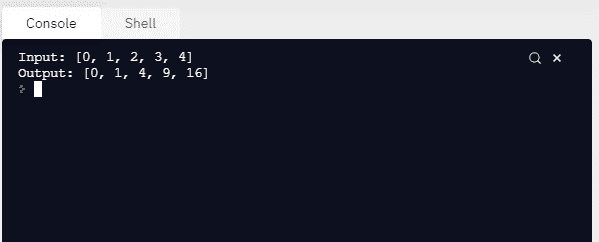
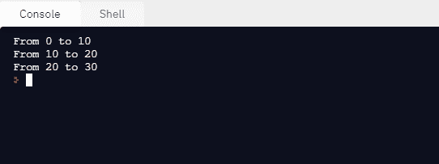

# Python–用不同的参数并行运行相同的功能

> 原文:[https://www . geeksforgeeks . org/python-不同参数并行运行相同函数/](https://www.geeksforgeeks.org/python-run-same-function-in-parallel-with-different-parameters/)

在本文中，我们将学习如何用不同的参数并行运行同一个函数。我们可以使用并行处理，用不同的参数并行运行相同的函数。

通过并行处理可以增加程序执行的任务数量，从而减少总处理时间。这些有助于解决大规模问题。使用标准的多处理模块，通过创建子进程，我们可以有效地并行化简单的任务。该模块提供了一个易于使用的界面，并包括一组任务提交和同步处理实用程序。

**进场:**

*   我们可以通过将多处理过程子类化来构建一个独立运行的过程。我们可以通过扩展 __init_ 方法来初始化资源，也可以通过实现 Process.run()方法来为子流程编写代码。我们在下面的代码中看到了如何构建一个进程，它打印了分配的 id。
*   我们需要初始化我们的流程对象，并调用 Process.start()方法来生成流程。在这里，Process.start()将创建一个新的进程，并调用一个名为 Process.run()的方法。
*   p.start()之后的代码在进程 p 完成任务之前立即执行。您可以使用 Process.join 等待任务完成()。

让我们用一些例子来理解这一点。

**例 1:**

## 蟒蛇 3

```py
import multiprocessing
import time

# Process class
class Process(multiprocessing.Process):
    def __init__(self, id):
        super(Process, self).__init__()
        self.id = id

    def run(self):
        time.sleep(1)
        print("I'm the process with id: {}".format(self.id))

if __name__ == '__main__':
    p = Process(0)

    # Create a new process and invoke the
    # Process.run() method
    p.start()

    # Process.join() to wait for task completion.
    p.join()
    p = Process(1)
    p.start()
    p.join()
```

**输出:**


我们还可以使用 Pool 类，用不同的参数并行运行相同的函数。对于并行映射，我们必须首先初始化多处理。Pool()对象。第一个论点是工人的数量；如果没有给出，这个数字将等于系统中元素的数量。

**例 2:**

举个例子看看。在这个例子中，我们将看到如何传递一个计算数字平方的函数。使用 Pool.map()，我们可以将函数映射到列表，并将函数和输入列表作为参数传递，如下所示:

## 蟒蛇 3

```py
import multiprocessing
import time

# square function
def square(x):
    return x * x

if __name__ == '__main__':

    # multiprocessing pool object
    pool = multiprocessing.Pool()

    # pool object with number of element
    pool = multiprocessing.Pool(processes=4)

    # input list
    inputs = [0, 1, 2, 3, 4]

    # map the function to the list and pass
    # function and input list as arguments
    outputs = pool.map(square, inputs)

    # Print input list
    print("Input: {}".format(inputs))

    # Print output list
    print("Output: {}".format(outputs))
```

**输出:**



**例 3:**

## 蟒蛇 3

```py
from multiprocessing import Pool

def print_range(range):

    # print range
    print('From {} to {}:'.format(range[0], range[1]))

def run_parallel():

    # list of ranges
    list_ranges = [[0, 10], [10, 20], [20, 30]]

    # pool object with number of elements in the list
    pool = Pool(processes=len(list_ranges))

    # map the function to the list and pass 
    # function and list_ranges as arguments
    pool.map(print_range, list_ranges)

# Driver code
if __name__ == '__main__':
    run_parallel()
```

**输出:**

