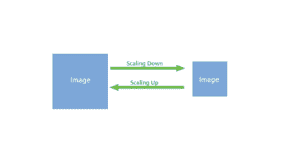
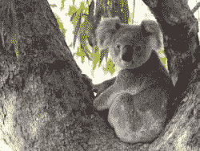

# Python–使用 pgmagic 缩放图像

> 原文:[https://www . geesforgeks . org/python-scaling-image-using-pgmagic/](https://www.geeksforgeeks.org/python-scaling-image-using-pgmagic/)

**缩放**是调整图像大小的过程。我们处理图像的尺寸。缩小指的是使图像变小，而放大指的是增加图像的大小。缩放在图像处理中是一个非常重要的过程，因为有时我们得到的图像尺寸比预期的要小，有时又非常大。所以，为了使图像达到完美的尺寸，需要使用缩放。

在本文中，我们将学习如何使用 python 中的 pgmagick 执行缩放。

**Code :**

```py
# importing library
from pgmagick.api import Image

img = Image('gog.png')

# scaling image
img.scale((150, 100), 'lanczos')
img.write('scale_gog.png')
```

**输入图像:**

**输出:**


**缩放 JPEG 图像–**
JPEG 代表**联合摄影专家组**。由于高达 16，777，216 2^24 的高数字色彩支持，这通常用于每个数码相机。并支持不同级别的压缩。

```py
# importing library
from pgmagick import Image, Blob

img = Image(Blob(open('koala.jpeg').read()))

# scaling image
img.scale('250x200')
img.write('scale_koala.jpeg')
```

**输入图像:**

**输出:**
