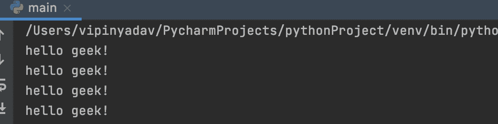

# 每 5 分钟执行一次的 Python 脚本

> 原文:[https://www . geesforgeks . org/python-脚本-每 5 分钟执行一次/](https://www.geeksforgeeks.org/python-script-that-is-executed-every-5-minutes/)

在本文中，我们将讨论如何在每 5 分钟后执行一个 Python 脚本。让我们讨论一些这样做的方法。

**方法 1:使用时间模块**

我们可以创建一个 Python 脚本，它将在每个特定的时间执行。我们将在 time.sleep()函数中传递给定的时间间隔，并使 while 循环为真。该功能将在给定的时间间隔内休眠。之后，它将开始执行。

**代码:**

## 蟒蛇 3

```py
import time

while(True):
    print('hello geek!')
    time.sleep(300)
```

**输出:**



**方法二:使用日程模块**

在 Schedule 模块的帮助下，我们可以制作一个 python 脚本，该脚本将在每个给定的特定时间间隔内执行。在 **schedule.run_pending()** 的帮助下，我们将检查调度器是否有一个待运行的函数。

**代码:**

## 蟒蛇 3

```py
import schedule
import time

def func():
    print("Geeksforgeeks")

schedule.every(1).minutes.do(func)

while True:
    schedule.run_pending()
    time.sleep(1)
```