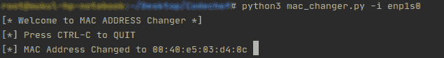

# Python 脚本更改 Linux 机器的 MAC 地址

> 原文:[https://www . geesforgeks . org/python-脚本到更改-MAC-address-of-Linux-machine/](https://www.geeksforgeeks.org/python-script-to-change-mac-address-of-linux-machine/)

**什么是 MAC 地址:**在计算机网络中， [MAC 地址](https://www.geeksforgeeks.org/introduction-of-mac-address-in-computer-network/)用于最低的网络级别，网络接口在此相互通信。[详见此处](https://www.geeksforgeeks.org/introduction-of-mac-address-in-computer-network/)。

**需要更改 MAC 地址:**

*   要绕过媒体访问控制地址过滤
*   绕过某种 MITM 欺骗攻击
*   为了避免公共网络中的设备跟踪

还有许多其他任务，如在网络中匿名，以及避免一些网络攻击，其中更改媒体访问控制地址变得有用。

**在 Linux 机器中更改 MAC 地址:**在 Linux 中，更改 MAC 地址的一个简单方法是使用`ifconfig`命令。
如果还没有安装，我们可以使用:

```py
sudo apt-get update
sudo apt-get install ifconfig

```

安装此软件包后，我们可以使用以下方法更改媒体访问控制地址:

```py
sudo ifconfig <interface-name> down
sudo ifconfig <interface-name> hw ether <new-mac-address> 
sudo ifconfig <interface-name> up

```

我们可以通过以下方式查看接口列表:

```py
ifconfig
```

**使用 Python 的自动化:**由于我们不可能每次都手动更改 MAC 地址，所以我们可以使用 Python 自动化更改 MAC 地址的过程。该脚本将在一段恒定的时间内不断更改媒体访问控制地址。
下面是上面想法的实现。

```py
# Python Script to change MAC Address

# Import Useful modules
import sys
import subprocess
import argparse
import random
import time
import re

# Function to get the interface name
def get_arguments():
    # This will give user a neat CLI
    parser = argparse.ArgumentParser()
    # We need the interface name
    parser.add_argument("-i", "--interface",
                dest="interface",
                help="Name of the interface. "
                "Type ifconfig for more details.")
    options = parser.parse_args()
    # Check if interface was given
    if options.interface:
        return options.interface
    else:
        parser.error("[!] Invalid Syntax. "
                     "Use --help for more details.")

# Function to change the MAC Address
def change_mac(interface, new_mac_address):
    # As explained above, these lines will
    # execute these commands for us
    subprocess.call(["sudo", "ifconfig", interface,
                     "down"])
    subprocess.call(["sudo", "ifconfig", interface,
                     "hw", "ether", new_mac_address])
    subprocess.call(["sudo", "ifconfig", interface,
                     "up"])

# Function to generate a random MAC Address
def get_random_mac_address():
    characters = "0123456789abcdef"
    random_mac_address = "00"
    for i in range(5):
        random_mac_address += ":" + \
                        random.choice(characters) \
                        + random.choice(characters)
    return random_mac_address

# Function to get the current MAC Address
# We will use it restore MAC address
# in case something goes wrong.
def get_current_mac(interface):
    output = subprocess.check_output(["ifconfig",
                                      interface])
    return re.search("\w\w:\w\w:\w\w:\w\w:\w\w:\w\w",
                  str(output)).group(0)

# Driver Program
if __name__ == "__main__":
    print("[* Welcome to MAC ADDRESS Changer *]")
    print("[*] Press CTRL-C to QUIT")
    # Change it to required value(in sec)
    TIME_TO_WAIT = 60
    interface = get_arguments()
    current_mac = get_current_mac(interface)
    try:
        while True:
            random_mac = get_random_mac_address()
            change_mac(interface, random_mac)
            new_mac_summary = subprocess.check_output(
                ["ifconfig", interface])
            if random_mac in str(new_mac_summary):
                print("\r[*] MAC Address Changed to",
                      random_mac,
                      end=" ")
                sys.stdout.flush()
            # Wait for a constant period of time
            time.sleep(TIME_TO_WAIT)

    except KeyboardInterrupt:
        # Restore the MAC before quitting.
        change_mac(interface, current_mac)
        print("\n[+] Quitting Program...")
```

**输出:**
