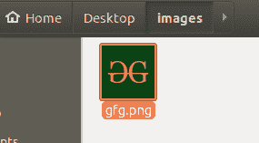
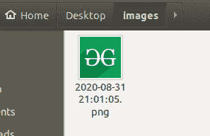

# Python 脚本将文件名更改为其时间戳

> 原文:[https://www . geesforgeks . org/python-脚本到更改文件名到其时间戳/](https://www.geeksforgeeks.org/python-script-to-change-name-of-a-file-to-its-timestamp/)

数字时间戳是一系列字符(通常是数字和分隔符的组合)，用于标识特定事件发生的时间。在计算机科学中，时间戳通常用于标记虚拟实体的创建时间，但不限于此。数字时间戳在不同的标准中实现，每个标准都支持特定的用例。即，一些标准使用不太精确的时间戳(仅存储事件的日期)，一些标准将时区信息编码在时间戳中。但是时间戳的基本语法在标准之间基本保持不变，这防止了异化，并提供了选择的灵活性。

在本文中，我们将学习如何获取文件的创建日期，并使用该日期创建一个[**【ISO 8601】**](https://en.wikipedia.org/wiki/ISO_8601)时间戳。用来命名文件的。

**使用的功能:**

*   [**OS . path . getctime():**](https://www.geeksforgeeks.org/python-os-path-getctime-method/)*****OS . path . getctime()***方法在 Python 中用来获取系统的 *ctime* 的指定路径。这里 *ctime* 指的是*【UNIX】*中指定路径的最后一次元数据更改，而在 *Windows* 中，它指的是路径创建时间。**
*   ****time.strptime():** 用于将字符串对象转换为时间对象。**
*   **[**time . strftime():**](https://www.geeksforgeeks.org/time-strftime-function-in-python/)**time . strftime(格式[，t])** 函数将表示由 gmtime() 或 localtime() 返回的时间的 tuprl 或 struct_time 转换为由格式参数指定的字符串。
    如果未提供 t，则使用 localtime() 返回的当前时间。格式必须是字符串。**
*   **[**OS . rename():**](https://www.geeksforgeeks.org/python-os-rename-method/)***OS . rename()***方法在 Python 中是用来重命名文件或目录的。
    此方法将源文件/目录重命名为指定的目标文件/目录。**

****重命名前的文件:****

****

## **蟒蛇 3**

```py
import time
import os

# Getting the path of the file
f_path = "/location/to/gfg.png"

# Obtaining the creation time (in seconds)
# of the file/folder (datatype=int)
t = os.path.getctime(f_path)

# Converting the time to an epoch string
# (the output timestamp string would
# be recognizable by strptime() without
# format quantifers)
t_str = time.ctime(t)

# Converting the string to a time object
t_obj = time.strptime(t_str)

# Transforming the time object to a timestamp
# of ISO 8601 format
form_t = time.strftime("%Y-%m-%d %H:%M:%S", t_obj)

# Since colon is an invalid character for a
# Windows file name Replacing colon with a
# similar looking symbol found in unicode
# Modified Letter Colon " " (U+A789)
form_t = form_t.replace(":", "꞉")

# Renaming the filename to its timestamp
os.rename(
    f_path, os.path.split(f_path)[0] + '/' + form_t + os.path.splitext(f_path)[1])
```

****重命名后的文件:****

****

****使用上述代码时需要牢记的事项:****

*   **这段代码是针对 Windows 操作系统的。对于 windows 以外的操作系统，用户可以省略 ***form_t = form_t.replace(":"，"꞉")*** 语句，因为它仅在 windows 中是必需的，因为操作系统不允许使用冒号作为文件名。对于在其他操作系统中的使用，最后一条语句( *os.rename())* 也应该进行相应的修改。**
*   ***str time()*、**% Y-% M-% d % H:% M:% S”**的参数是格式说明符。这用于指导*str time()的输出。*该格式说明符可以按照其他时间戳标准的语法进行更改。**
*   ****os.path.split(f_path)[0]** 在最后一条语句中是获取文件根目录(父目录)的路径。**
*   ****OS . path . splitext(f _ path)[1]**用于将原始文件的文件扩展名(如果有)添加到时间戳中**