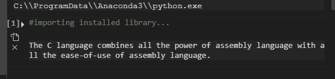
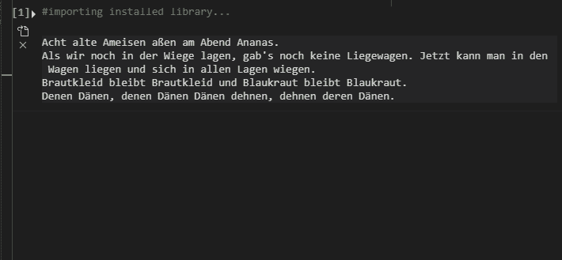

# Python 脚本使用 py chambers 创建随机笑话

> 原文:[https://www . geesforgeks . org/python-脚本-创建-随机-笑话-使用-py chambers/](https://www.geeksforgeeks.org/python-script-to-create-random-jokes-using-pyjokes/)

Python 支持使用它的一个库创建随机笑话。让我们再深入探讨一下，**py jocks**是一个 python 库，用于为程序员创建单行笑话。非正式地说，它也可以被称为一个有趣的 python 库，使用起来非常简单。让我们看看您如何实际使用它来执行所需的任务，

## 装置

您可以使用 pip 和以下命令简单地安装它:

```
pip install pyjokes
```

## 使用

现在要使用它，我们需要使用以下命令在 python 脚本中导入已安装的库:

```
import pyjokes
```

在进一步进入 python 脚本之前，有必要熟悉一下 py challenges 库的两个功能，即**get _ challenge()和 get _ jokes()。**

## **功能**

*   **get_joke()**

**语法:**

```
get_joke(language,category)
```

顾名思义，这个函数实际上是用来从某个类别和特定语言中返回一个笑话的(类别和语言将在本文后面介绍)。

*   **get _ 段子()**

**语法:**

```
get_jokes(language,category)
```

它类似于 get_joke()函数，唯一的区别在于，它不是返回单个笑话，而是返回某个类别和特定语言的随机笑话列表。

### 因素

语言和类别是 get_joke()和 get _ joke()函数的两个参数。

语言指定您希望笑话以哪种语言显示。默认情况下，返回英语笑话的设置为“en”。语言参数的所有其他可能值描述如下:

<figure class="table">

| **语言** | **值** |
| 中的 | 英语 |
| (加在动词之前）表示“否定”，“相反”；(加在名词之前构成动词)表示“除去”，“除掉” | 德国人 |
| 是吗 | 西班牙语 |
| 它 | 意大利的 |
| 标距长度 | 加利西亚的 |
| 欧盟 | 巴斯克人 |

</figure>

同样，category 参数指定您希望笑话显示的类别。默认情况下，它被设置为“中性”。类别参数的所有其他可能值描述如下:

<figure class="table">

| **类别** | **值** |
| 中立的 | 中性的极客笑话 |
| 难题 | 绕口令 |
| 全部 | 所有类型的笑话 |

</figure>

下面是一些更好理解的例子:

**示例** **1:** 使用 get_joke()生成单个笑话

## 蟒蛇 3

```
# importing installed library
import pyjokes

# using get_joke() to generate a single joke
#language is english
#category is neutral
My_joke = pyjokes.get_joke(language="en", category="neutral")

print(My_joke)
```

**输出**:



**示例 2:** 使用 get _ jokes()生成笑话列表

## 蟒蛇 3

```
import pyjokes

# using get_jokes() to generate a whole list of jokes
# language is german
# category is twister
list_of_jokes = pyjokes.get_jokes(language="de", category="twister")

# traversing through the generated list of jokes
# Range of i may change, depending on the number of jokes
# you want to display
for i in range(0, 4):
    print(list_of_jokes[i], sep='\n')
```

**输出**:

