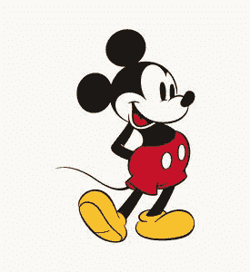
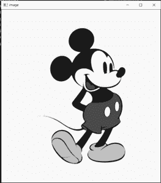
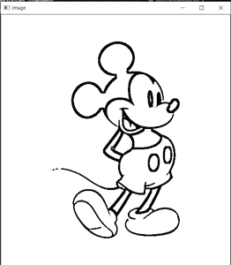
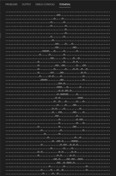

# Python 脚本从任意图像生成点状文本

> 原文:[https://www . geesforgeks . org/python-脚本-从任意图像生成点状文本/](https://www.geeksforgeeks.org/python-script-to-generate-dotted-text-from-any-image/)

**先决条件:** [Python OpenCV](https://www.geeksforgeeks.org/opencv-python-tutorial/)

在本文中，我们将看到如何使用 Python3 来创建代表图像的点状文本。我们在消息和社交媒体中使用这种类型的文本，生成它们是一项有趣的图像处理任务。

这个任务需要我们定义给定图像的边缘。之后，我们可以使用任何符号，如“.”、“o”或“x”来显示亮像素和暗像素。

*   首先创建一个新的 python 脚本并安装[打开 CV](https://pypi.org/project/opencv-python/) 。

```py
python3 -m pip install opencv-python --user
```

*   现在导入 cv2 并加载您想要转换的图像。这里的图像名是“mic.jpg”，它在同一个目录中。我们需要在灰度模式下使用图像，所以给一个额外的参数在灰度模式下加载。

```py
# import the required modules
import cv2

# Read the image
img = cv2.imread('mic.jpg',0)
```

*   我们可以降低图像中的噪声，从而平滑地检测出圆角和边缘。我们可以用 cv2 的 medianblur()方法来实现。

```py
# Apply median blur
img = cv2.medianBlur(img,5)
```

*   为了检测边缘，我们在 openCV 中有各种各样的阈值函数。但是在这种情况下，最兼容的是 ADAPTIVE_THRESH_MEAN_C。此外，我们还可以检查其他阈值函数。

```py
# Apply MEAN thresholding to get refined edges
image = cv2.adaptiveThreshold(img,255,cv2.ADAPTIVE_THRESH_MEAN_C,cv2.THRESH_BINARY,11,2)
```

现在我们有一个只有边缘的图像。我们可以迭代我们的图像来打印亮点和暗点，这将为我们生成虚线文本。如果图像太大，我们可以使用 cv2.resize()来缩小图像，以便可以使用。

**实施:**

## 蟒蛇 3

```py
# Python script to convert the given image
# into a dotted text using opencv

# import the required modules
import cv2

# Read the image
img = cv2.imread('mic.jpg', 0)

# Apply median blur
img = cv2.medianBlur(img, 5)

# Apply MEAN thresholding to get refined edges
image = cv2.adaptiveThreshold(
    img, 255, cv2.ADAPTIVE_THRESH_MEAN_C, cv2.THRESH_BINARY, 11, 2)

# Convert the image into a compatible size
# We will use 60 pixels wide image so that text
# fits in the console

# Preserve the ratio
ratio = len(image)/len(image[0])
# Assign new width and calculate new height
new_width = 60
new_height = int(ratio*new_width)
# Resize the image
image = cv2.resize(image, (new_height, new_width))

# Iterate over the array and print the dark pixels
# or we can use any other symbol too.
for i in range(len(image)):
    for j in range(len(image[0])):
        print("o" if image[i, j] < 100 else ".", end="")
    print()
```

*   **原图:**



*   **应用中值模糊后的灰度图像:**



*   **应用自适应平均阈值后的图像:**



*   **控制台上打印的最终输出:**

